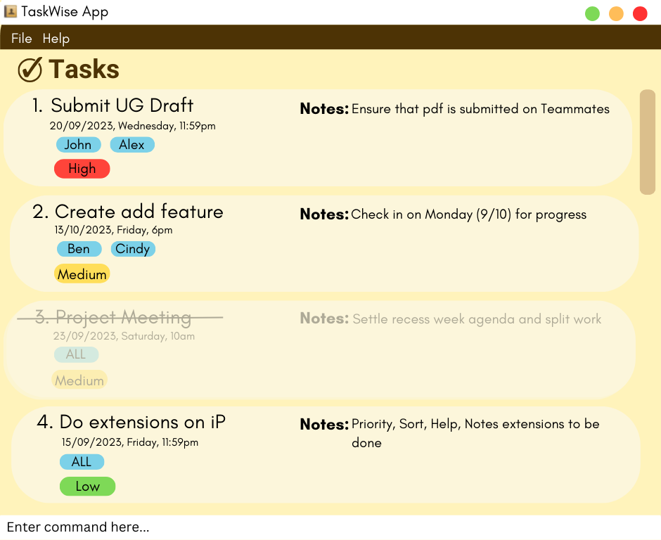

# About TaskWise
This project is based on the AddressBook-Level3 project created by the [SE-EDU initiative](https://se-education.org).

It is modified to create a **task management application** named _TaskWise_.

It aims to provide the project manager of a CS2103T group with a fast and intuitive CLI to manage their team project, by providing them a platform to manage different deadlines for different tasks, allowing them to be more on task and keep up with deadlines within one project.

## Features
Below and some of the features that TaskWise provides:
- **Add and delete tasks**: Add and delete project tasks to the task list.
- **Mark tasks as done**: Mark tasks as done when they are completed.
- **Edit tasks**: Edit the details of a task.
- **Find tasks**: Find tasks by searching for keywords.
- **Add priority to tasks**: Add priority to tasks to indicate their importance.
- **Add deadline to tasks**: Add deadline to tasks to indicate when they are due.
- **Add notes to tasks**: Add notes to tasks to provide additional information.
- **Allocate tasks to team members**: Allocate tasks to team members to indicate who is responsible for the task.
- **Sort tasks**: Sort tasks by description, priority and deadline.

## Links
- [User Guide](https://docs.google.com/document/d/1K1zzikbvhjpHor5Ojw0zFVt02ODpOsojrnjz1fSPwIY/edit?usp=sharing)
- [User Stories](https://docs.google.com/document/d/1uk-aV06Lu2xX8SkyAiJdZPcEHYN7I0KGXfyskkbbcwY/edit?usp=sharing)
- [Github Project Board](https://github.com/orgs/AY2324S1-CS2103T-T17-1/projects/1)
- [Github Organization](https://github.com/AY2324S1-CS2103T-T17-1)
