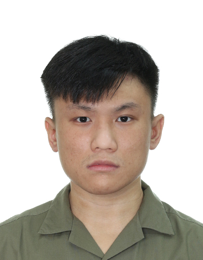

We are a team based in the [School of Computing, National University of Singapore](http://www.comp.nus.edu.sg).

You can reach us at the email `seer[at]comp.nus.edu.sg`

## Project Team

### Sebastian Tay

[[github](https://github.com/Sebtey)]
[[portfolio](team/sebtey.md)]

* Role: Developer
* Responsibilities: Testing, Code Quality

### George Tay

[[github](http://github.com/asdfghjkxd)]
[[portfolio](team/asdfghjkxd.md)]

* Role: DevOps/GitHub Expert
* Responsibilities: Implementing and maintaining DevOps tools and processes on GitHub

### May Thandar Hinn

[[github](http://github.com/maypfv)]
[[portfolio](team/maypfv.md)]

* Role: Deliverables & Deadlines
* Responsibilities: Manage schedules, deliverables.

### Sean Teh

[[github](http://github.com/seantehds)]
[[portfolio](team/seantehds.md)]

* Role: Team Lead
* Responsibilities: Code Quality

### Justin Cheah

[[github](http://github.com/jcsnap)]
[[portfolio](team/jcsnap.md)]

* Role: Documentation
* Responsibilities: Responsible for the quality of various project documents such as User Guide.
