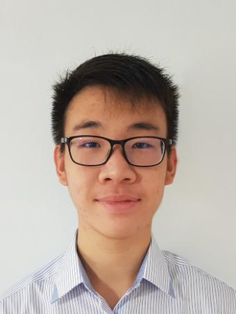
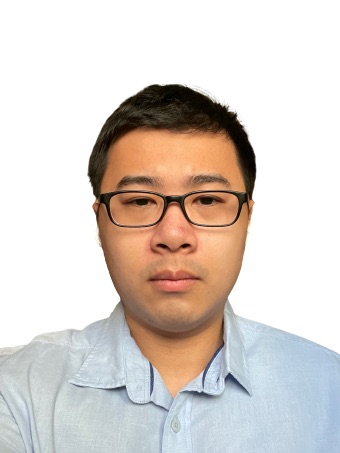
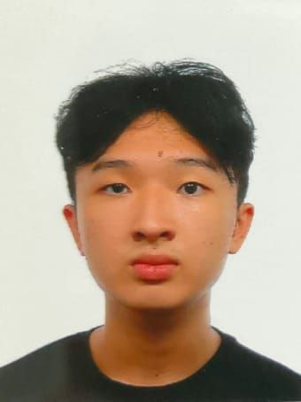

We are a team based in the [School of Computing, National University of Singapore](http://www.comp.nus.edu.sg).

You can reach us at the email `seer[at]comp.nus.edu.sg`

## Project team

### Sebastian Tay

[[homepage](http://www.comp.nus.edu.sg/~damithch)]
[[github](https://github.com/Sebtey)]
[[portfolio](team/johndoe.md)]

* Role: Developer
* Responsibilities: Testing, Code Quality

### George Tay

[[github](http://github.com/asdfghjkxd)]
[[portfolio](team/asdfghjkxd.md)]

* Role: DevOps/GitHub Expert
* Responsibilities: Implementing and maintaining DevOps tools and processes on GitHub

### Johnny Doe

[[github](http://github.com/johndoe)] [[portfolio](team/johndoe.md)]

* Role: Developer
* Responsibilities: Data

### Jean Doe

[[github](http://github.com/johndoe)]
[[portfolio](team/johndoe.md)]

* Role: Developer
* Responsibilities: Dev Ops + Threading

### Justin Cheah

[[github](http://github.com/jcsnap)]
[[portfolio](team/jcsnap.md)]

* Role: Documentation
* Responsibilities: Responsible for the quality of various project documents such as User Guide.
