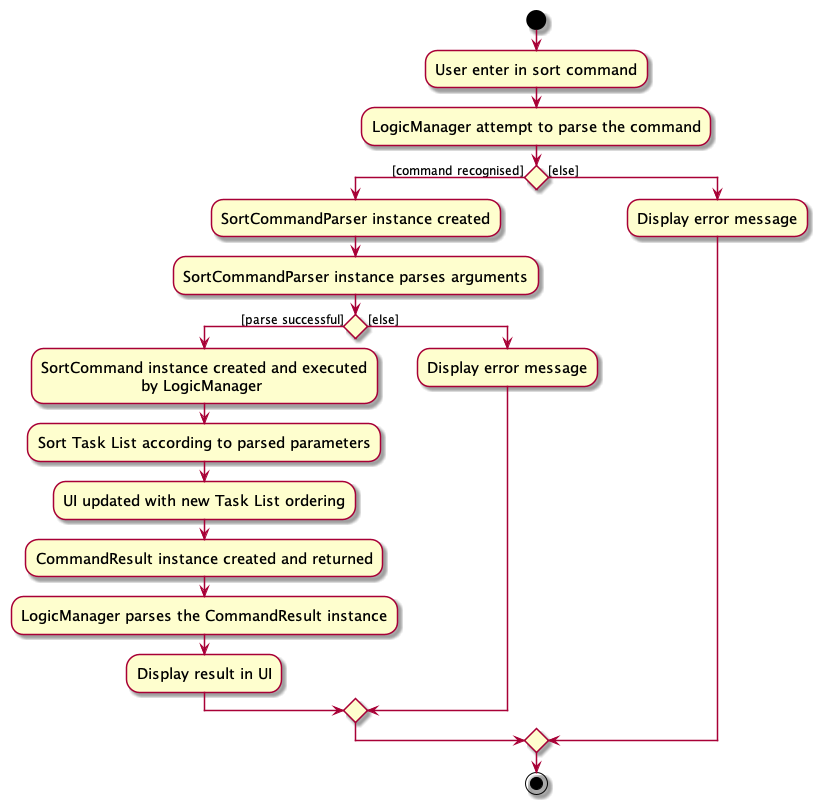
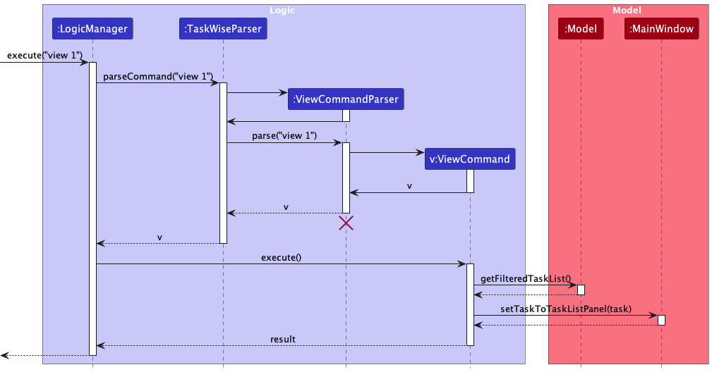
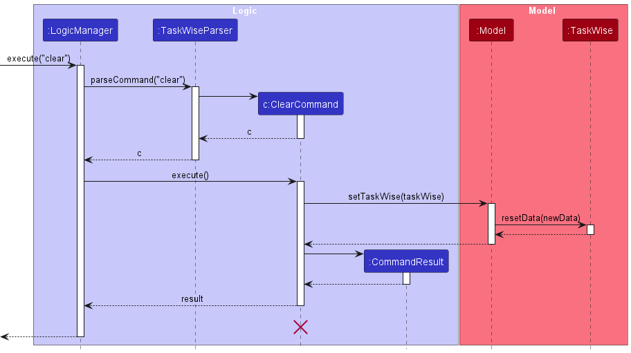

Welcome to the TaskWise Developer Guide!

## Content

- [Acknowledgements](#acknowledgements)
- [Introduction](#introduction)
- [Getting Started](#getting-started)
- [Design](#design)
    - [Architecture](#architecture)
        - [UI Component](#ui-component)
        - [Logic Component](#logic-component)
        - [Model Component](#model-component)
        - [Storage Component](#storage-component)
        - [Common Classes](#common-classes)
    - [Exception Handling](#exception-handling)
- [Implementation](#implementation)
    - [Add Feature](#add-feature)
    - [Mark Feature](#mark-feature)
    - [Unmark Feature](#unmark-feature)
    - [Edit Feature](#edit-feature)
        - [Adding Deadlines](#adding-deadlines)
        - [Updating Description](#updating-description)
        - [Updating Priority of Existing Tasks](#updating-priority-of-existing-tasks)
        - [Assigning Members to Existing Tasks](#assigning-members-to-existing-tasks)
        - [Updating Note](#updating-note)
    - [Sort Feature](#sort-feature)
    - [Note Feature](#note-feature)
    - [View Feature](#view-feature)
    - [Find Feature](#find-feature)
    - [List Feature](#list-feature)
    - [Delete Feature](#delete-feature)
    - [Clear Feature](#clear-feature)
- [Documentation, Logging, Testing, Configuration and DevOps](#documentation-logging-testing-configuration-and-devops)
- [Appendix: Requirements](#appendix-requirements)
    - [Product Scope](#product-scope)
        - [Value Proposition](#value-proposition)
        - [Target Audience](#target-audience)
    - [User Stories](#user-stories)
    - [Use Cases](#use-cases)
    - [Non-Functional Requirements](#non-functional-requirements)
    - [Glossary](#glossary)
- [Appendix: Planned Enhancements](#appendix-planned-enhancements)
    - [Adding Tasks With Same Description and Different Other Parameters](#adding-tasks-with-same-description-and-different-other-parameters)
    - [Better Clarity Regarding Deadlines That Have Passed](#better-clarity-regarding-deadlines-that-have-passed)
    - [Different Modes of Edit Command](#different-modes-of-edit-command)
        - [Append Mode](#append-mode)
        - [Edit Mode](#edit-mode)
        - [Overwrite Mode](#overwrite-mode)
    - [Improve Find Command To Find By Priority, Deadline, Members and Notes](#improve-find-command-to-find-by-priority-deadline-members-and-notes)
    - [Case-insensitive Sort](#case---insensitive-sort)
    - [Case-insensitive Ordering of Members](#case---insensitive-ordering-of-members)
- [Appendix: Instructions for Manual Testing](#appendix-instructions-for-manual-testing)
- [Appendix: Effort](#appendix-effort)

# Acknowledgements

This project was built on top of the existing [AddressBook Level 3 Code from SE-EDU](https://github.com/se-edu/addressbook-level3).

Apart from that, we reused some code from other sources:

* Libraries used:
    * [JavaFX](https://openjfx.io/)
    * [Jackson](https://github.com/FasterXML/jackson)
    * [JUnit5](https://github.com/junit-team/junit5)
* Code Reused:
    * [StackOverflow](https://stackoverflow.com/)
        * [Implementing Global Key Strokes Recognition](https://copyprogramming.com/howto/implementing-a-global-key-press-for-javafx-methods)
        * [Defining Behaviours When ListView Cells are Clicked](https://stackoverflow.com/questions/52184611/javafx-keep-oldvalue-and-newvalue-of-listview-the-same-when-condition-has-not-b)
    * [ChatGPT](https://chat.openai.com/)
        * Generating Regex strings used for DateTime parsing
    * [Regex101](https://regex101.com/)
        * Building and Testing Regex strings generated by ChatGPT

# Introduction

Welcome to the TaskWise Developer Guide!

Through this guide, you will learn more about the vision behind TaskWise, how TaskWise was built and how you as a Developer can use TaskWise and build upon it!

# Getting Started

Before you begin your development journey in TaskWise, make sure that you meet the minimum requirements needed to run TaskWise on your development device!

## Minimum Requirements

TaskWise uses Java 11 with JavaFX. If you are not sure how to install Java 11 and JavaFX, refer to [this guide](#UserGuide.html#installation-guide) in the User Guide to install and start TaskWise.

:warning: This step is crucial to ensure that the features you develop will work well with other components in TaskWise!

## What's Next?

Now that you have installed Java 11 and JavaFX, you may wish to start developing new features or fix bugs that exist in TaskWise!

Refer to the [Design section](#design) to get a clearer view of how TaskWise is built, and how you can get started in developing new components to integrate into TaskWise!

Looking for more information on the existing features of TaskWise? Refer to the [Implementation section](#implementation) to get up to date with the implementation of existing features within TaskWise!

Want more information on how we built TaskWise, and how you can use our workflows in your own project? Refer to the [Documentation, Logging, Testing, Configuration and DevOps section](#documentation-logging-testing-configuration-and-devops) for more information on how we documented, tested and developed TaskWise, and how you can integrate our workflows into your own!

Unclear on why we built TaskWise? Head over to the [Appendix: Requirements Section](#appendix-requirements) for a clearer picture of what was on our minds when we developed TaskWise, and how TaskWise was built with the end user's needs in mind!

# Design

The following segment describes the internal structure of TaskWise.

## Architecture

The ***Architecture Diagram*** given above explains the high-level design of the App.

Given below is a quick overview of the main components and how they interact with each other.

**Main components of the architecture**

**`Main`** (consisting of classes [`Main`](https://github.com/AY2324S1-CS2103T-T17-1/tp/blob/master/src/main/java/seedu/address/Main.java) and [`MainApp`](https://github.com/AY2324S1-CS2103T-T17-1/tp/blob/master/src/main/java/seedu/address/MainApp.java)) is in charge of the app launch and shut down.
* At app launch, it initializes the other components in the correct sequence, and connects them up with each other.
* At shutdown, it shuts down the other components and invokes cleanup methods where necessary.

The bulk of the app's work is done by the following four components:

* [**`UI`**](#ui-component): The UI of the App.
* [**`Logic`**](#logic-component): The command executor.
* [**`Model`**](#model-component): Holds the data of the App in memory.
* [**`Storage`**](#storage-component): Reads data from, and writes data to, the hard disk.

[**`Commons`**](#common-classes) represents a collection of classes used by multiple other components.

**How the architecture components interact with each other**

The *Sequence Diagram* below shows how the components interact with each other for the scenario where the user issues the command `delete 1`.

Each of the four main components (also shown in the diagram above),

* defines its *API* in an `interface` with the same name as the Component.
* implements its functionality using a concrete `{Component Name}Manager` class (which follows the corresponding API `interface` mentioned in the previous point.

For example, the `Logic` component defines its API in the `Logic.java` interface and implements its functionality using the `LogicManager.java` class which follows the `Logic` interface. Other components interact with a given component through its interface rather than the concrete class (reason: to prevent outside components' being coupled to the implementation of a component), as illustrated in the (partial) class diagram below.

The sections below give more details of each component.

### UI Component

The **API** of this component is specified in [`Ui.java`](https://github.com/AY2324S1-CS2103T-T17-1/tp/tree/master/src/main/java/seedu/address/ui/Ui.java)

The UI consists of a `MainWindow` that is made up of parts e.g.`CommandBox`, `ResultDisplay`, `TaskListPanel`, `StatusBarFooter` etc. All these, including the `MainWindow`, inherit from the abstract `UiPart` class which captures the commonalities between classes that represent parts of the visible GUI.

The `UI` component uses the JavaFX UI framework. The layout of these UI parts is defined in matching `.fxml` files that are in the `src/main/resources/view` folder. For example, the layout of the [`MainWindow`](https://github.com/AY2324S1-CS2103T-T17-1/tp/tree/master/src/main/java/seedu/address/ui/MainWindow.java) is specified in [`MainWindow.fxml`](https://github.com/AY2324S1-CS2103T-T17-1/tp/tree/master/src/main/resources/view/MainWindow.fxml).

The `UI` component,

* executes user commands using the `Logic` component.
* listens for changes to `Model` data so that the UI can be updated with the modified data.
* keeps a reference to the `Logic` component, because the `UI` relies on the `Logic` to execute commands.
* depends on some classes in the `Model` component, as it displays `Task` objects residing in the `Model`.

### Logic Component

**API** : [`Logic.java`](https://github.com/AY2324S1-CS2103T-T17-1/tp/tree/master/src/main/java/seedu/address/logic/Logic.java)

Here's a (partial) class diagram of the `Logic` component:

The sequence diagram below illustrates the interactions within the `Logic` component, taking `execute("delete 1")` API call as an example.

:information_source: **Note:** The lifeline for `DeleteCommandParser` should end at the destroy marker (X) but due to a limitation of PlantUML, the lifeline reaches the end of diagram.

How the `Logic` component works:

1. When `Logic` is called upon to execute a command, it is passed to a `TaskWiseParser` object which in turn creates a parser that matches the command (e.g., `DeleteCommandParser`) and uses it to parse the command.
1. This results in a `Command` object (more precisely, an object of one of its subclasses e.g., `DeleteCommand`) which is executed by the `LogicManager`.
1. The command can communicate with the `Model` when it is executed (e.g. to delete a person).
1. The result of the command execution is encapsulated as a `CommandResult` object which is returned back from `Logic`.

Here are the other classes in `Logic` (omitted from the class diagram above) that are used for parsing a user command:

How the parsing works:

* When called upon to parse a user command, the `TaskWiseParser` class creates an `XYZCommandParser` (`XYZ` is a placeholder for the specific command name e.g., `AddCommandParser`) which uses the other classes shown above to parse the user command and create a `XYZCommand` object (e.g., `AddCommand`) which the `TaskWiseParser` returns back as a `Command` object.
* All `XYZCommandParser` classes (e.g., `AddCommandParser`, `DeleteCommandParser`, ...) inherit from the `Parser` interface so that they can be treated similarly where possible e.g, during testing.

### Model Component

**API** : [`Model.java`](https://github.com/AY2324S1-CS2103T-T17-1/tp/tree/master/src/main/java/seedu/address/model/Model.java)

The `Model` component,

* stores the TaskWise data i.e., all `Task` objects (which are contained in a `UniqueTaskList` object).
* stores the currently 'selected' `Task` objects (e.g., results of a search query) as a separate _filtered_ list which is exposed to outsiders as an unmodifiable `ObservableList<Task>` that can be 'observed' e.g. the UI can be bound to this list so that the UI automatically updates when the data in the list change.
* stores a `UserPref` object that represents the user’s preferences. This is exposed to the outside as a `ReadOnlyUserPref` objects.
* does not depend on any of the other three components (as the `Model` represents data entities of the domain, they should make sense on their own without depending on other components).

Included inside the Task model are the following attributes:
* `Description`
    * Encapsulates a string attribute indicating the description of the task.
* `Status`
    * Encapsulates a boolean attribute indicating the completion status of the task containing that status instance.
* `Deadline`
    * Encapsulates a LocalDateTime object as an attribute, indicating a certain deadline for the task the Deadline object is associated with.
* `Note`
    * Encapsulates a string attribute indicating the additional information of the task containing the task.
* `Members`
    * A set of member instances, each encapsulating the name of the respective members assigned to the task.
* `Priority`
    * Encapsulates levels of priority as enumerations, highlighting the importance or urgency of the task it is associated with.

The attributes status, description and deadline are immutable classes.
Being immutable allows us to be consistent across editing a specific task and updating the status of the task through the mark/unmark commands. It also helps us to improve the clarity of whether a task is completed or incomplete.

### Storage Component

**API** : [`Storage.java`](https://github.com/AY2324S1-CS2103T-T17-1/tp/blob/master/src/main/java/seedu/address/storage/Storage.java)

The `Storage` component,
* can save both TaskWise data and user preference data in JSON format, and read them back into corresponding objects.
* inherits from both `TaskWiseStorage` and `UserPrefStorage`, which means it can be treated as either one (if only the functionality of only one is needed).
* depends on some classes in the `Model` component (because the `Storage` component's job is to save/retrieve objects that belong to the `Model`.

### Common Classes

Classes used by multiple components are in the `seedu.address.commons` package.

## Exception Handling

There are 3 main classes of Exceptions or Errors that are recognised by the application, namely the `CommandException`, `ParseException` and `StorageException` Exception classes. Most Exceptions or Errors that are thrown during normal operation of the app should extend from these 3 classes. Any other Exceptions or Errors that are thrown that do not extend from the prior 3 classes will **not** be caught and handled, and will instead be thrown back to the user.

Here is a quick overview of the 3 main Exception classes in TaskWise:

We shall now go through the 3 different classes of recognised Exceptions and Errors, before going through the other unrecognised Exceptions and Errors that may be thrown.

### `CommandException`

`CommandException` represents a generic error which occurs when a `Command` object is executed.

You are strongly discouraged from throwing this Exception class as a general catch-all exception when something goes wrong when the user tries to execute a `Command`, as it may lack the necessary information which you need to find out what is wrong with the code and prevent you from debugging later on!

Should you find yourself requiring more Exception classes to handle any new errors that arise when you extend the app, create new Exception classes, extend from `CommandException`, and throw the new class instead!

There are *3* other derived classes of `CommandException`, which are the `DuplicatedTaskException`, `IllegalCommandException` and `IllegalTaskIndexException` classes. We shall explore the classes in detail in the next few sections.

#### `DuplicatedTaskException`

This Exception is thrown when the user attempts to create a new Task with the same Task name as any Tasks already existing in their Task list.

This is due to the fact that duplicated Tasks are not permitted in the current version of the application.

#### `IllegalCommandException`

This Exception is thrown when the user attempts to do something that they do not have sufficient permission for, or are attempting to invoke undefined behaviour within TaskWise.

This Exception is meant to be a generic error which other Exceptions can extend from, but it may be thrown if necessary.

#### `IllegalTaskIndexException`

This Exception is thrown when the user attempts to input a Task index that is not permitted. This Exception extends from the above `IllegalCommandException`.

Some examples of task indices that are not permitted include: `-1` (negative indices), `10.0` (floating points) and `10` (when there is only `9` tasks in the task list).

#### `IllegalTaskStatusModificationException`

This Exception is thrown when the user attempts to mark a Task that is already completed or unmark a task that is not completed.

For example, if a given Task is already marked as completed when the user attempts to mark the Task again, this Exception will be thrown.

### `ParseException`

`ParseException` is another generic error which occurs when there w is issue encountered when a `Parser` tries to parse an input from the user. Usually, this error arises due to user error (e.g. wrong commands, invalid or illegal inputs), and should **not** be the result of developer error.

#### `DuplicatedPrefixException`

This Exception is thrown when the same `Prefix` is detected more than once in the same command.

For example, if the command `add t/task t/another task` is entered, the duplicated `t/` `Prefix` will be detected, and this Exception will be thrown.

#### `IllegalArgumentException`

This Exception is thrown when the user enters a valid command but with invalid arguments. This Exception is mainly thrown by parsing methods found in `ParserUtil`, which handles the parsing of Task Index, Description, Tag, Sort Order and Sort Type.

#### `InvalidCommandException`

This Exception is thrown when the user attempts to execute a command that is not recognised by TaskWise.

Only commands recognised by TaskWise will be parsed and executed. Any unknown command will result in this Exception being thrown, alerting users that the input command they have entered is invalid.

#### `InvalidFormatException`

This Exception is thrown when the user inputs a command with essential arguments to the command missing.

An example of this would be the `add` command: `add` is invalid, and will result in this Exception being thrown.

#### `NoRecordedModificationException`

This Exception is thrown when the user indicates that they would like to edit a certain Task on their Task list, but failed to specify any changes made to said Task, i.e. they failed to properly modify the Task.

### `StorageException`

`StorageException` is the final class of generic error which occurs when there is an issue loading data from the save files of TaskWise.

#### `IllegalJsonValueException`

This Exception is thrown when the data stored in TaskWise's JSON data files do not meet some constraints imposed by the Task model.

#### `IllegalJsonDescriptionValueException`

This Exception is thrown when the stored Task Description is corrupted and cannot be read from the JSON data file.

#### `IllegalJsonTagValueException`

This Exception is thrown when the stored Task Tags are corrupted and cannot be read from the JSON data file.

#### `IllegalJsonDuplicatedValueException`

This Exception is thrown when the JSON data file is illegally modified or corrupted, resulting in the inclusion of a duplicate Task.

#### `FileStorageLoadException`

This Exception is thrown when there are any issues encountered when loading data from any data files.

#### `InsufficientStoragePrivilegeException`

This Exception is thrown when the user fails to grant TaskWise sufficient access privilege to their file system, resulting in TaskWise being unable to read or write to the data files TaskWise creates while in operation.

#### `StorageReadWriteException`

This Exception is thrown when there is an error encountered when TaskWise is trying to read or write from the data files.

Note that this error differs from [`InsufficientStoragePrivilegeException`](#insufficientstorageprivilegeexception) in that access is granted, but the data file could not be recognised and hence parsed within TaskWise, hence leading to an error being raised.

### Unrecognised Exceptions

Any other Exceptions not mentioned above should not, under most circumstances, be thrown and not be handled by any method within TaskWise, as they will not be caught by TaskWise's internal Exception handling system, leading to the user's application crashing catastrophically.

Developers are recommended to extend the current Exception classes already provided to specify new Exceptions that they would like to handle, rather than throwing any Exceptions directly that are not on the list of pre-approved Exceptions unless there is a legitimate reason to do so.

# Implementation

## General Implementation of Commands In TaskWise

This class diagram is applicable for the following commands: `Add`, `Mark`, `Unmark`, `Delete`, `Edit`, `Note`.

From the diagram, we are able to note some aspects of the command:

* `XYZCommand` follows the overall Facade design pattern that is used in TaskWise to dispatch commands to be executed.
  `XYZCommand` implements the `Command` interface, thereby allowing TaskWise to execute the Command without having to know what Command `XYZCommand` represents.
* `XYZCommandParser` does most of the heavy lifting in preparing a XYZ Command for execution.
* Refer to the [`logic`](#logic-component) diagram and [`model`](#model-component) diagrams for more information regarding the `Logic` and `Model` classes and processes.

We can break down the class diagram further by analysing how XYZ Command is executed in TaskWise. Given below is the sequence diagram detailing the overall process of executing XYZ Command:

## Add Feature

The Add feature is facilitated by `TaskWise` which implements`ReadOnlyTaskWise`, stored internally as a `UniqueTaskList`. Additionally, it implements the `AddCommand#execute()` operation.

The following sequence diagram shows how the add operation works for `add t/Complete DG`:

The process is given as such:

1. The user enters an `add` command into the CLI.
2. `LogicManager` receives the call to execute the input command via the `execute()` method.
3. `LogicManager` then parses the input command via the `parseCommand()` method, and dispatches the call to the correct `AddCommandParser`.
4. The created `AddCommandParser` then parses the parameters of the command via the `parse()` method.
5. If the parse is successful, a new instance of `AddCommand` with the relevant parsed parameters is created and returned to the caller.
6. The `AddCommand` object is then returned back to `LogicManager`, which invokes the `execute()` method of the `AddCommand` object.
    1. `AddCommand` will then call its `createAddedTask(AddTaskDescriptor)` method which will create a new instance of `Task` with the given inputs.
    2. After which, it will add the newly created `Task` into the task list using the `addTask(task)`.
    3. If the addition is successful, a new `CommandResult` object is then created and returned to the caller of the `AddCommand::execute()` method.
7. `LogicManager` receives the `CommandResult` object returned from the execution of the `AddCommand` and parses it.
8. The execution of `AddCommand` terminates.

Here is the activity diagram from when a user inputs an add command:

[Add Activity Diagram](images/AddActivityDiagram.png)

### Alternatives Considered
We considered allowing the add feature to add `Notes`, `Member`, `Deadline`, and `Priority` at one go. However, we also needed to consider ease of use by the user when entering all these attributes at one go using the `add` command. Therefore, we concluded that these 4 attributes should be optional to be entered all at once using `add`.

Only the `Description` has been made compulsory. The `Edit` feature will allow users to add and update `Deadline`, `Priority`. The `Note` and `Assign` features will allow for `note` and `member` to be added respectively.

## Mark Feature

Given below is the sequence diagram from when a user enters a `mark` command.

The process is given as such:

1. The user enters a `mark` command into the CLI.
2. `LogicManager` receives the call to execute the input command via the `execute()` method.
3. `LogicManager` then parses the input command via the `parseCommand()` method, and dispatches the call to the correct `MarkCommandParser`.
4. The created `MarkCommandParser` then parses the parameters of the command via the `parse()` method.
5. If the parse is successful, a new instance of `MarkCommand` with the relevant parsed parameters is created and returned to the caller.
6. The `MarkCommand` object is then returned back to `LogicManager`, which invokes the `execute()` method of the `MarkCommand` object.
    1. `MarkCommand` will then call the `setTask()` method on `Model`, which will in turn call the `setTask()` method on `TaskWise`, replacing the old `Task` with a new instance of the `Task` with an updated completed status.
    2. If the existing `Task` is already marked as completed, an exception is thrown to inform the user that they are attempting to `mark` a `Task` already marked as completed.
    3. If the marking of the `Task` is successful, a new `CommandResult` object is then created and returned to the caller of the `MarkCommand::execute()` method.
7. `LogicManager` receives the `CommandResult` object returned from the execution of the `MarkCommand` and parses it.
8. The execution of `MarkCommand` terminates.

We implemented the `mark` command this way as we wanted to preserve the original architecture that was present in AddressBook3. Furthermore, by separating the `mark` command into multiple steps, involving multiple components that all handle different responsibilities, we believe that it satisfies the Single Responsibility principle.

Here is the activity diagram from when a user inputs a `mark` command:

## Unmark Feature

Given below is the sequence diagram from when a user enters an `unmark` command.

The process is given as such:

1. The user enters a `unmark` command into the CLI.
2. `LogicManager` receives the call to execute the input command via the `execute()` method.
3. `LogicManager` then parses the input command via the `parseCommand()` method, and dispatches the call to the correct `UnmarkCommandParser`.
4. The created `UnmarkCommandParser` then parses the parameters of the command via the `parse()` method.
5. If the parse is successful, a new instance of `UnmarkCommand` with the relevant parsed parameters is created and returned to the caller.
6. The `UnmarkCommand` object is then returned back to `LogicManager`, which invokes the `execute()` method of the `UnmarkCommand` object.
    1. `UnmarkCommand` will then call the `setTask()` method on `Model`, which will in turn call the `setTask()` method on `TaskWise`, replacing the old `Task` with a new instance of the `Task` with an updated incomplete status.
    2. If the existing `Task` is already marked as incomplete, an exception is thrown to inform the user that they are attempting to `unmark` a `Task` already marked as incomplete.
    3. If the marking of the `Task` is successful, a new `CommandResult` object is then created and returned to the caller of the `UnmarkCommand::execute()` method.
7. `LogicManager` receives the `CommandResult` object returned from the execution of the `MarkCommand` and parses it.
8. The execution of `UnmarkCommand` terminates.

We implemented the `unmark` command this way as we wanted to preserve the original architecture that was present in AddressBook3. Furthermore, by separating the `unmark` command into multiple steps, involving multiple components that all handle different responsibilities, we believe that it satisfies the Single Responsibility principle.

Here is the activity diagram from when a user inputs a `unmark` command:

### Alternatives Considered
Instead of having multiple components, we could have just had one `MarkCommand`/`UnmarkCommand` class and have that class be in charge of handling everything, from parsing the inputs from the user to modifying the model when the command is executed. However, we did not proceed with that plan, as doing so would create a `MarkCommand`/`UnmarkCommand` class that would have multiple responsibilities, which may lead to the singular `MarkCommand`/`UnmarkCommand` class requiring multiple changes when different, separate requirements change.

## Edit Feature

The Edit feature is facilitated by `EditCommand` which extends `Command`. It makes use of `EditTaskDescriptor` which encapsulates the details of the fields to be edited.

:information_source: As of now, editing a task will only overwrite the existing information of the specified fields with the new information.

We are working on implementing different modes of editing a `Task` in our [future implementations](#edit-command---different-modes).

### Adding Deadlines

The adding of `Deadline` to the existing `Task` will be accomplished using the `EditCommand` class. When the `EditCommand` is executed, the `Task` at the specified index will be updated to contain a `Deadline` object containing information about the task's deadline.

### Updating Description

The updating of the `Description` of an existing `Task` will be accomplished using the `EditCommand` class. When the `EditCommand` is executed, the `Task` at the specified index will be updated to reflect the new `Description` object.

### Updating Priority of Existing Tasks

The updating of `Priority` of existing Tasks is accomplished using the `EditCommand` class. When the `EditCommand` is executed, the `Priority` level of the `Task` is updated to the desired level of `LOW`, `MEDIUM` or `HIGH` that was specified in the edit command argument.

### Assigning Members to Existing Tasks

Assigning group members to an existing task can be done using the `EditCommand` class.

The process is given as such:

1. The user enters an `edit` command into the CLI.
2. `LogicManager` receives the call to execute the input command via the `execute()` method.
3. `LogicManager` then parses the input command via the `parseCommand()` method, and dispatches the call to the correct `EditCommandParser`.
4. The created `EditCommandParser` then parses the parameters of the command via the `parse()` method.
5. If the parse is successful, a new instance of `EditCommand` with the relevant parsed parameters is created and returned to the caller.
6. The `EditCommand` object is then returned back to `LogicManager`, which invokes the `execute()` method of the `EditCommand` object.
    1. `EditCommand` will then call the `getFilteredTaskList()` method on `Model`, retrieving the filtered task lists before calling the `get(Index)` method on the task lists to retrieve the task to edit.
    2. `EditCommand` will then call its `createEditedTask(Task, EditTaskDescriptor)` method which will create a new instance of `Task` with the updated set of members.
    3.  After which, it will replace the old `Task` with the new instance of `Task` in the task list.
    4. If the edit is successful, a new `CommandResult` object is then created and returned to the caller of the `EditCommand::execute()` method.
7. `LogicManager` receives the `CommandResult` object returned from the execution of the `EditCommand` and parses it
8. The execution of `EditCommand` terminates.

To remove the assigned members to a task, the project manager can use the edit command `edit 1 a/` whereby it will remove all assigned members of the task at index 1.

### Updating Note

Editing a note can also be done using the `EditCommand` class. When the `EditCommand` is executed, the note in the specified task will be overwritten with the note in the command's arguments.

## Sort Feature

Some attributes within the Tasks are comparable with each other as they implement the `java.lang.Comparable<T>` interface. These attributes are: `Description`, `Status`, `Deadline` and `Priority`.

:information_source: **Disclaimer:** Currently, only sorting by Task Description and Status is working, as the other attributes of Task are work-in-progress!

These comparable attributes form the basis on which this Sort Command is built upon. With these comparable attributes, we are able to sort the Task List using these attributes to obtain an ordered representation of the Task List.

The following diagram shows the association between classes necessary to achieve the sort feature:

We can break down the class diagram further by analysing how the Sort Command is executed in TaskWise. Given below is the sequence diagram detailing the overall process of executing a Sort Command:

The process is given as such:

1. The user enters a `sort` command into the CLI.
2. `LogicManager` receives the call to execute the input command via the `execute()` method.
3. `LogicManager` then parses the input command via the `parseCommand()` method, and dispatches the call to the correct `SortCommandParser`.
4. The created `SortCommandParser` then parses the parameters of the command via the `parse()` method.
5. If the parse is successful, a new instance of `SortCommand` with the relevant parsed parameters is created and returned to the caller.
6. The `SortCommand` object is then returned back to `LogicManager`, which invokes the `execute()` method of the `SortCommand` object.
    1. Firstly, the `SortCommand` object makes a call to the `Model` using the method `getTaskWise()` and `getTaskList()`, returning the list of Tasks.
    2. The returned List of Tasks is then sorted using the aforementioned specified parameters.
    3. After the sort, `SortCommand` invokes the `setAllTasks()` method on `Model`, setting the internal filtered list of `Model` to the sorted Tasks.
    4. A new `CommandResult` object detailing the success of the sort command is then created and returned to the caller of the `SortCommand::execute()` method.
7. `LogicManager` receives the `CommandResult` object returned from the execution of the `SortCommand` and parses it.
8. The execution of `SortCommand` terminates.

For a more intuitive understanding of the above process as described by the Sequence Diagram, refer to the below Activity Diagram for a clearer understanding of the Sort Command, and how it is executed in TaskWise.

### Alternatives Considered

We have considered not implementing this feature due to the overhead in code that we need to write and maintain within the codebase, and that enforcing comparability between different attributes of Task could prove challenging down the line when the project is extended and more attributes need to be considered to get a proper ordering of Tasks.

However, we have decided to implement the feature in the end, as we conclude that the benefits of providing users with a useful feature to help them organise their Tasks far outweigh the challenges we may face in the future when code needs to be maintained or extended.

To mitigate the problems that the extension of code may cause, we decided to implement the sorting parameters as Enums, hence allowing us as maintainers to easily extend the sort feature to new attributes added to Tasks with just a few lines of code.

## Note Feature

The Note feature is facilitated by the `NoteCommand` which extends `Command`.

Given below is the sequence diagram detailing the overall process of executing a Note Command:

The process is given as such:

1. The user enters a `note` command into the CLI.
2. `LogicManager` receives the call to execute the input command via the `execute()` method.
3. `LogicManager` then parses the input command via the `parseCommand()` method, and dispatches the call to the correct `NoteCommandParser`.
4. The created `NoteCommandParser` then parses the parameters of the command via the `parse()` method.
5. If the parse is successful, a new instance of `NoteCommand` with the relevant parsed parameters is created and returned to the caller.
6. The `NoteCommand` object is then returned back to `LogicManager`, which invokes the `execute()` method of the `NoteCommand` object.
    1. Then, `NoteCommand` invokes the `setTask()` method on `Model`, which in turn invokes the `setTask()` method on `TaskWise`, replacing the old Task with a new instance of the Task with the Note.
    2. A new `CommandResult` object detailing the success of the `note` command is then created and returned to the caller of the `NoteCommand::execute()` method.
7. `LogicManager` receives the `CommandResult` object. returned from the execution of the `NoteCommand` and parses it.
8. The execution of `NoteCommand` terminates.

### Alternatives Considered

Initially, we were considering whether to make the requirement for `Note` as stringent as `Description`, where we disallow empty string. However, we realized that there is a key difference between `Note` and `Description` that makes `Note` less "strict" than `Description`, which is that a `Description` can never be empty while a `Note` can be empty. Thus, we have decided to proceed with the less strict requirement for `Note`.

Here is the activity diagram from when a user inputs a note command:

[Note Activity Diagram](images/NoteActivityDiagram.png)

# View Feature

The View feature is facilitated by the `ViewCommand` which extends `Command`.

Given below is the sequence diagram detailing the overall process of executing a View Command.

1. The user enters a `view` command into the CLI.
2. `LogicManager` receives the call to execute the input command via the `execute()` method.
3. `LogicManager` then parses the input command via the `parseCommand()` method, and dispatches the call to the correct `ViewCommandParser`.
4. The created `ViewCommandParser` then parses the parameters of the command via the `parse()` method.
5. If the parse is successful, a new instance of `ViewCommand` with the relevant parsed parameters is created and returned to the caller.
6. The `ViewCommand` object is then returned back to `LogicManager`, which invokes the `execute()` method of the `ViewCommand` object.
    1. Then, `ViewCommand` invokes the `getFilteredTaskList()` method on `Model` to get the task specified by the index.
    2. The `ViewCommand` then invokes the `setTaskToTaskListPanel` method of the main window, passing in the task.
7. `LogicManager` receives the `CommandResult` object. returned from the execution of the `ViewCommand` and parses it.
8. The execution of `ViewCommand` terminates.

### Alternatives Considered
We initially thought of using the observer pattern to update the UI when the task in focus changes. However, we realized that that would require a large refactoring and thus we deem it not worth pursuing.

Here is the activity diagram from when a user inputs a view command:

[View Activity Diagram](images/ViewActivityDiagram.png)

# Find Feature

The Find feature is facilitated by the `FindCommand` which extends `Command`.

Given below is the sequence diagram detailing the overall process of executing a Find Command:

The process is given as such:

1. The user enters a `find` command into the CLI.
2. `LogicManager` receives the call to execute the input command via the `execute()` method.
3. `LogicManager` then parses the input command via the `parseCommand()` method, and dispatches the call to the correct `FindCommandParser`.
4. The created `FindCommandParser` then parses the parameters of the command via the `parse()` method.
5. If the parse is successful, a new instance of `FindCommand` with the relevant parsed parameters is created and returned to the caller.
6. The `FindCommand` object is then returned back to `LogicManager`, which invokes the `execute()` method of the `FindCommand` object.
    1. Then, `FindCommand` invokes the `updateFilteredTaskList()` method on `Model`, which in turn invokes the `setPredicate()` method on `filteredTasks`, updating the `FilteredTaskList` within the `Model`.
    2. A new `CommandResult` object detailing the success of the `find` command is then created and returned to the caller of the `FindCommand::execute()` method.
7. `LogicManager` receives the `CommandResult` object. returned from the execution of the `FindCommand` and parses it.
8. The execution of `FindCommand` terminates.

# List Feature

The List feature is facilitated by the `ListCommand` which extends `Command`.

Given below is the sequence diagram detailing the overall process of executing a List Command:

The process is given as such:

1. The user enters a `list` command into the CLI.
2. `LogicManager` receives the call to execute the input command via the `execute()` method.
3. `LogicManager` then parses the input command via the `parseCommand()` method, and dispatches the call to the correct `ListCommand`.
4. The `ListCommand` object is then returned back to `LogicManager`, which invokes the `execute()` method of the `ListCommand` object.
    1. Then, `ListCommand` invokes the `updateFilteredTaskList()` method on `Model`, which in turn invokes the `setPredicate()` method on `filteredTasks`, updating the `FilteredTaskList` within the `Model`.
    2. A new `CommandResult` object detailing the success of the `list` command is then created and returned to the caller of the `ListCommand::execute()` method.
5. `LogicManager` receives the `CommandResult` object. returned from the execution of the `ListCommand` and parses it.
6. The execution of `ListCommand` terminates.

# Delete Feature

The Delete feature is facilitated by the `DeleteCommand` which extends `Command`.

Given below is the sequence diagram detailing the overall process of executing a Delete Command:

The process is given as such:

1. The user enters a `delete` command into the CLI.
2. `LogicManager` receives the call to execute the input command via the `execute()` method.
3. `LogicManager` then parses the input command via the `parseCommand()` method, and dispatches the call to the correct `DeleteCommandParser`.
4. The created `DeleteCommandParser` then parses the parameters of the command via the `parse()` method.
5. If the parse is successful, a new instance of `DeleteCommand` with the relevant parsed parameters is created and returned to the caller.
6. The `DeleteCommand` object is then returned back to `LogicManager`, which invokes the `execute()` method of the `DeleteCommand` object.
    1. Then, `DeleteCommand` invokes the `getFilteredTaskList()` method on `Model`, which will return the `FilteredList<Task>` object called `filteredList`.
    2. The `targetIndex` to delete will be verified to ensure that it is valid, otherwise, an exception will be thrown to inform the user that the index is invalid.
    3. Then, the `deleteTask()` method will be invoked on `Model` which in turn invokes the `removeTask()` method on `TaskWise`.
    4. A new `CommandResult` object detailing the success of the `delete` command is then created and returned to the caller of the `DeleteCommand::execute()` method.
7. `LogicManager` receives the `CommandResult` object. returned from the execution of the `DeleteCommand` and parses it.
8. The execution of `DeleteCommand` terminates.

# Clear Feature

The Clear feature is facilitated by the `ClearCommand` which extends `Command`.

Given below is the sequence diagram detailing the overall process of executing a Clear Command:

The process is given as such:

1. The user enters a `clear` command into the CLI.
2. `LogicManager` receives the call to execute the input command via the `execute()` method.
3. `LogicManager` then parses the input command via the `parseCommand()` method.
4. If the parse is successful, a new instance of `ClearCommand` is created.
6. The `ClearCommand` object is then returned back to `LogicManager`, which invokes the `execute()` method of the `ClearCommand` object.
    1. Then, `ClearCommand` invokes the `setTaskWise()` method on `Model`, which will in turn call the `resetData()` method on`TaskWise` with a `new TaskWise()` instance.
    2. A new `CommandResult` object detailing the success of the `clear` command is then created and returned to the caller of the `ClearCommand::execute()` method.
7. `LogicManager` receives the `CommandResult` object. returned from the execution of the `ClearCommand` and parses it.
8. The execution of `ClearCommand` terminates.

# Documentation, Logging, Testing, Configuration and DevOps

* [Documentation guide](Documentation.md)
* [Testing guide](Testing.md)
* [Logging guide](Logging.md)
* [Configuration guide](Configuration.md)
* [DevOps guide](DevOps.md)

# Appendix: Requirements

## Product Scope

### Value Proposition

Provide the project manager of a CS2103T group a fast and intuitive CLI to manage their team project, by providing them a platform to manage different deadlines for different tasks, allowing them to be more on task and keep up with deadlines within one project.

### Target Audience

Our target audience for this application are Project Managers of CS2103T Group Projects.

## User Stories

| Priority | As a/an ...                  | I want to ...                                                                        | So that I can...                                               |
|----------|---------------------------|--------------------------------------------------------------------------------------|----------------------------------------------------------------|
| `* * *`  | user                      | be able to add tasks to my list of tasks                                             | track tasks to be done                                         |
| `* * *`  | project manager           | be able to delete tasks from my list of tasks                                        | remove tasks that are completed or wrongly added               |
| `* * *`  | project manager           | be able to view all my tasks                                                         | get a high-level overview of what needs to be done             |
| `* * *`  | project manager           | be able to mark tasks that were unmarked                                             | update the progress of the task                                |
| `* * *`  | clumsy project manager    | be able to unmark tasks that were marked in case I accidentally marked them          | undo my mistake                                                |
| `* * *`  | forgetful manager         | be told that I have entered an invalid command                                       | be informed if the command I entered is invalid                |
| `* *`    | project manager           | be able to assign deadlines to tasks                                                 | know when I need to finish the task by                         |
| `* *`    | forgetful team member     | have a project manager who can track what tasks I need to do                         | be on track for deliverables                                   |
| `* *`    | busy project manager      | be able to see the task's level of priority                                          | be aware of what the team and I need to prioritise and do next |
| `* *`    | forgetful project manager | be able to add additional information relevant to my tasks                           | manage my tasks without missing out important details          |
| `* *`    | timely project manager    | be able to group my tasks by priorities, deadlines, completion status and task names | better track the tasks are that important to my project        |
| `* *`    | organized project manager    | be able to declutter and clear my tasks in the task list once the project has been completed | better manage only tasks that are relevant to the project I am currently working on |
| `* *`    | busy project manager    | be able to quickly and easily find tasks that are within my to-do list | spend less time trying to find out information about certain tasks |
| `* *` | meticulous project manager | be able to see the complete information of the task | make sure that no details have been missed out on |
| `* *` | meticulous project manager | be able to edit the information of the task | make sure that the task's details remains accurate |
| `* *` | big project manager | be able to see the group members whom I delegated to each task | follow up with the right party on the progress of the respective tasks |

## Use Cases

### UC01: Add a task
Actor(s): Project Manager  
Guarantees:
* A task is added to the system list of tasks.

**MSS**

1. User inputs a command to add a task.
2. System adds the task into a list of task and <u>[displays the updated task list (UC03)](#UC03-View-all-tasks)</u>.

Use case ends.

**Extensions:**
1a. User enters an invalid command.  
&ensp;&ensp;1a1. System warns that the <u>[command is invalid (UC06)](#UC06-Warn-on-Invalid-Command)</u>.  
&ensp;&ensp;1a2. User acknowledges the warning.  
1b. User enters an illegal command.  
&ensp;&ensp;1b1. System warns that the <u>[command is illegal (UC07)](#UC07-Warn-on-Illegal-Command)</u>.  
&ensp;&ensp;1b2. User acknowledges the warning.

Use case ends.

### UC02: Delete a task
Actor(s): Project Manager  
Guarantees:
* The specified task is successfully deleted from the system.

**MSS**

1. User inputs a command to delete a certain task.
2. System deletes the task and <u>[displays the updated task list (UC03)](#UC03-View-all-tasks)</u>.

Use case ends.

**Extensions:**
1a. User enters an invalid command.  
&ensp;&ensp;1a1. System warns that the <u>[command is invalid (UC06)](#UC06-Warn-on-Invalid-Command)</u>.  
&ensp;&ensp;1a2. User acknowledges the warning.  
1b. User enters an illegal command.  
&ensp;&ensp;1b1. System warns that the <u>[command is illegal (UC07)](#UC07-Warn-on-Illegal-Command)</u>.  
&ensp;&ensp;1b2. User acknowledges the warning.

Use case ends.

### UC03: View all tasks

Actor(s): Project Manager

**MSS**

1. User opens up the application.
2. System displays a list of tasks to the user.

Use case ends.

**Extensions:**
1a. User enters an invalid command.  
&ensp;&ensp;1a1. System warns that the <u>[command is invalid (UC06)](#UC06-Warn-on-Invalid-Command)</u>.  
&ensp;&ensp;1a2. User acknowledges the warning.

Use case ends.

### UC04: Marks a task as done

Actor(s): Project Manager  
Guarantees:
* The specified task is successfully marked as complete in the system.

**MSS**

1. User inputs a command to mark a certain task as done.
2. System updates and marks the task as done.
3. Updated list of tasks is <u>[displayed to the user (UC03)](#UC03-View-all-tasks)</u>.

Use case ends.

**Extensions:**
1a. User enters an invalid command.  
&ensp;&ensp;1a1. System warns that the <u>[command is invalid (UC06)](#UC06-Warn-on-Invalid-Command)</u>.  
&ensp;&ensp;1a2. User acknowledges the warning.  
1b. User enters an illegal command.  
&ensp;&ensp;1b1. System warns that the <u>[command is illegal (UC07)](#UC07-Warn-on-Illegal-Command)</u>.  
&ensp;&ensp;1b2. User acknowledges the warning.

Use case ends.

### UC05: Unmarks a task that was marked as done

Actor(s): Project Manager  
Guarantees:
* The specified task is successfully marked as incomplete in the system.

**MSS**
1. User inputs a command to unmark certain task.
2. System updates and marks the task as incomplete.
3. Updated list of tasks is <u>[displayed to the user (UC03)](#UC03-View-all-tasks)</u>.

Use case ends.

**Extensions:**
1a. User enters an invalid command.  
&ensp;&ensp;1a1. System warns that the <u>[command is invalid (UC06)](#UC06-Warn-on-Invalid-Command)</u>.  
&ensp;&ensp;1a2. User acknowledges the warning.  
1b. User enters an illegal command.  
&ensp;&ensp;1b1. System warns that the <u>[command is illegal (UC07)](#UC07-Warn-on-Illegal-Command)</u>.  
&ensp;&ensp;1b2. User acknowledges the warning.

Use case ends.

### UC06: Warn on invalid command

Actor(s): Project Manager, System  
Guarantee(s):
* No commands will be executed.

**MSS**

1. User inputs an invalid command.
2. System warns user that the command entered is invalid.

Use case ends.

### UC07: Warn on illegal command

Actor(s): Project Manager, System  
Guarantee(s):
* Illegal command will not be executed.

**MSS**

1. User inputs an illegal command (valid command but the user has no permission to execute the command or argument is invalid).
2. System warns user that the command entered is illegal and cannot be completed.

Use case ends.

### UC08: Add a deadline to an existing task
Actor(s): Project Manager  
Guarantees:
* A deadline is added to an existing task in the list of tasks.

**MSS**

1. User inputs edit command to edit the deadline of an existing task.
2. System updates and adds the deadline to the specified task.
3. Updated list of tasks is <u>[displayed to the user (UC03)](#UC03-View-all-tasks)</u>.

Use case ends.

**Extensions:**

1a. User enters an invalid command.  
&ensp;&ensp;1a1. System warns that the <u>[command is invalid (UC06)](#UC06-Warn-on-Invalid-Command)</u>.  
&ensp;&ensp;1a2. User acknowledges the warning.  
1b. User enters an illegal command.  
&ensp;&ensp;1b1. System warns that the <u>[command is illegal (UC07)](#UC07-Warn-on-Illegal-Command)</u>.  
&ensp;&ensp;1b2. User acknowledges the warning.

Use case ends.

### UC09: Assign members to an existing task
Actor(s): Project Manager  
Guarantees:
* The specified member is assigned to the existing task.

**MSS**

1. User inputs edit command to assign member(s) to an existing task.
2. System assigns members to the existing task.
3. Updated list of tasks is <u>[displayed to the user (UC03)](#UC03-View-all-tasks)</u>.

Use case ends.

**Extensions:**

1a. User enters an invalid command.  
&ensp;&ensp;1a1. System warns that the <u>[command is invalid (UC06)](#UC06-Warn-on-Invalid-Command)</u>.  
&ensp;&ensp;1a2. User acknowledges the warning.  
1b. User enters an illegal command.  
&ensp;&ensp;1b1. System warns that the <u>[command is illegal (UC07)](#UC07-Warn-on-Illegal-Command)</u>.  
&ensp;&ensp;1b2. User acknowledges the warning.

Use case ends.

### UC10: Update the priority of an existing task
Actor(s): Project Manager  
Guarantees:
* The priority level of the task is updated to what was specified.

**MSS**

1. User inputs the edit command to update the priority of an existing task.
2. System updates the priority level of the specified task.
3. Updated list of tasks is <u>[displayed to the user (UC03)](#UC03-View-all-tasks)</u>.

Use case ends.

**Extensions:**

1a. User enters an invalid command.  
&ensp;&ensp;1a1. System warns that the <u>[command is invalid (UC06)](#UC06-Warn-on-Invalid-Command)</u>.  
&ensp;&ensp;1a2. User acknowledges the warning.  
1b. User enters an illegal command.  
&ensp;&ensp;1b1. System warns that the <u>[command is illegal (UC07)](#UC07-Warn-on-Illegal-Command)</u>.  
&ensp;&ensp;1b2. User acknowledges the warning.

Use case ends.

### UC11: Add a note to a task
Actor(s): Project Manager  
Guarantees:
* The note is added to the task.

**MSS**

1. User inputs a command to add note to an existing task.
2. System updates the task to include the note.
3. Updated list of task with note is <u>[displayed to the user (UC03)](#UC03-View-all-tasks)</u>.

Use case ends.

**Extensions:**

1a. User enters an invalid command.  
&ensp;&ensp;1a1. System warns that the <u>[command is invalid (UC06)](#UC06-Warn-on-Invalid-Command)</u>.  
&ensp;&ensp;1a2. User acknowledges the warning.  
1b. User enters an illegal command.  
&ensp;&ensp;1b1. System warns that the <u>[command is illegal (UC07)](#UC07-Warn-on-Illegal-Command)</u>.  
&ensp;&ensp;1b2. User acknowledges the warning.

Use case ends.

### UC12: Sort tasks in task list

Actor(s): Project Manager
Guarantees:
* If the sort is successful, the order of the Tasks on display will be changed(unless the Task List is already sorted)
* No matter if the order of the Task List changes or otherwise, all existing Tasks will be reassigned to the task list

**MSS**

1. User inputs command to sort the task list.
2. System parses the command and sorts the task list.
3. Updated task list is <u>[displayed to the user (UC03)](#UC03-View-all-tasks)</u>

Use case ends.

**Extensions:**

1a. User enters an invalid command.  
&ensp;&ensp;1a1. System warns that the <u>[command is invalid (UC06)](#UC06-Warn-on-Invalid-Command)</u>.  
&ensp;&ensp;1a2. User acknowledges the warning.  
1b. User enters an illegal command.  
&ensp;&ensp;1b1. System warns that the <u>[command is illegal (UC07)](#UC07-Warn-on-Illegal-Command)</u>.  
&ensp;&ensp;1b2. User acknowledges the warning.

Use case ends.

### UC13: Clear tasks in task list

Actor(s): Project Manager
Guarantees:
* All tasks in the task list are deleted.

**MSS**

1. User inputs a command to clear the task list.
2. System parses the command and clears all tasks from task list.
3. Updated empty task list is <u>[displayed to the user (UC03)](#UC03-View-all-tasks)</u>

Use case ends.

**Extensions:**

1a. User enters an invalid command.  
&ensp;&ensp;1a1. System warns that the <u>[command is invalid (UC06)](#UC06-Warn-on-Invalid-Command)</u>.  
&ensp;&ensp;1a2. User acknowledges the warning.

Use case ends.

### UC14: Find a task in the task list

Actor(s): Project Manager
Guarantees:
* All tasks that contain the keyword in their description will be retrieved for the user.

**MSS**

1. User inputs a command to find all tasks with a description that contains a specified keyword.
2. System parses the command and retrieves only tasks that have the keyword within their description.
3. New task list is displayed to the user.

Use case ends.

**Extensions:**

1a. User enters an invalid command.  
&ensp;&ensp;1a1. System warns that the <u>[command is invalid (UC06)](#UC06-Warn-on-Invalid-Command)</u>.  
&ensp;&ensp;1a2. User acknowledges the warning.

Use case ends.

### UC15: View a task
Actor(s): Project Manager
Guarantees:
* The full information about a task will be displayed on the side panel.

**MSS**

1. User inputs command to view a task.
2. System parses the command to retrieve all information about the task.
3. The full information about the task is displayed to the user.

Use case ends.

**Extensions:**

1a. User enters an invalid command.  
&ensp;&ensp;1a1. System warns that the <u>[command is invalid (UC06)](#UC06-Warn-on-Invalid-Command)</u>.  
&ensp;&ensp;1a2. User acknowledges the warning.

Use case ends.

### UC16: Edit the description of a task
Actor(s): Project Manager
Guarantees:
* The task's description gets updated.

**MSS**

1. User inputs a command to edit a task.
2. System updates the description of the task.
3. Updated list of task is <u>[displayed to the user (UC03)](#UC03-View-all-tasks)</u>.

Use case ends.

**Extensions:**

1a. User enters an invalid command.  
&ensp;&ensp;1a1. System warns that the <u>[command is invalid (UC06)](#UC06-Warn-on-Invalid-Command)</u>.  
&ensp;&ensp;1a2. User acknowledges the warning.  
1b. User enters an illegal command.  
&ensp;&ensp;1b1. System warns that the <u>[command is illegal (UC07)](#UC07-Warn-on-Illegal-Command)</u>.  
&ensp;&ensp;1b2. User acknowledges the warning.

Use case ends.

### UC17: Edit note of a task
Actor(s): Project Manager
Guarantees:
* The task's note gets updated.

**MSS**

1. User inputs the command to edit a task.
2. System updates the note of the task.
3. Updated list of task is <u>[displayed to the user (UC03)](#UC03-View-all-tasks)</u>.

Use case ends.

**Extensions:**

1a. User enters an invalid command.  
&ensp;&ensp;1a1. System warns that the <u>[command is invalid (UC06)](#UC06-Warn-on-Invalid-Command)</u>.  
&ensp;&ensp;1a2. User acknowledges the warning.  
1b. User enters an illegal command.  
&ensp;&ensp;1b1. System warns that the <u>[command is illegal (UC07)](#UC07-Warn-on-Illegal-Command)</u>.  
&ensp;&ensp;1b2. User acknowledges the warning.

Use case ends.

## Non-Functional Requirements

1. TaskWise should work on Windows/MacOS/Linux as long as the device has `Java 11` or above installed.
2. A user should be able to accomplish all of the tasks using commands rather than using a mouse.
3. The size of the JAR file should not be larger than 100 MB.
4. TaskWise should work without Internet connectivity.

## Glossary

* **Argument**: A word or number or a sequence of words or numbers that represent.
* **CLI**: A Command Line Interface is a text-based interface where users can interact with the software by typing commands.
* **Command**: A sequence of words that represents an action that TaskWise can understand and execute.
* **Deadline**: A class that represents the date that the task needs to be completed by.
* **Field**: Refers to the `Status`, `Deadline`, `Priority`, `Description`, `Member` of a Task.
* **GUI**: A Graphical User Interface is a visual interface where users can interact with the software through on-screen elements like buttons and windows.
* **JAR**: A file that contains all the resources needed for TaskWise to run.
* **Java**: A general-purpose programming language on which TextWise is built.
* **Member**: A class that represents the name of the project's group member(s).
* **Note**: A class that represents the additional string of information that you want to attach to a task
* **Priority**: A class that represents the priority level of the task.
* **Sort Order**: The ascending or descending order to sort the Task List by
* **Sort Type**: The fields within Task used to sort the Task List by
* **Status**: A class that represents whether a task is completed or not.
* **System**: The TaskWise program.
* **Task**: A Task is a completable objective with or without a deadline.

# Appendix: Planned Enhancements

## Adding Tasks With the Same Description and Different Other Parameters

As of now, TaskWise allows users to add tasks with the `Description` being the unique identifier. This means that they cannot add tasks with the same description, even if their deadlines, priorities, status or members involved are different.

However, there may be instances where users would want to add tasks with the same descriptions, if other details, such as their deadlines and members are different.

We propose that in the near future, tasks with the same description with at least a different deadline, priority, status or member(s) can be added to TaskWise. This would allow for more convenience for the users, as they can create tasks with the same description, as long as their other fields are different.

For example, the user has the task`CS2103T Meeting` with a deadline of `10-20-2023` in the task list. Then, they can still add another task with the same description `CS2103T Meeting` with a different deadline of `20-20-2023`.

## Better Clarity Regarding Deadlines That Have Passed

Currently, when a user inputs a date as a deadline for a task, there are no checks regarding whether the date input is before the current date and time. This is to allow users to input deadlines for tasks, even if they have already passed, to allow them to keep track of them in TaskWise.

However, it may be viewed by some users as unintentional, as they question why we would allow users to enter past dates, and believe that it is due to a lack of validation.

In future iterations of TaskWise, we plan to check the inputs given by users and see if they are using a date that has already passed. Users will still be allowed to proceed with adding the task with a deadline that has already passed but will be prompted by TaskWise as to whether they wish to proceed even with the addition of a past date to their deadline. If a mistake was made by the user, then by rejecting the prompt given to them, they would be able to reverse the state of TaskWise back to its original state.

Should the users proceed with adding the task with the specified deadline, they will be informed by TaskWise that a deadline has passed and that they have overdue tasks. These tasks will also be placed higher among the other tasks when TaskWise is booted up as well as whenever the list is sorted, to signify that they are of higher priority to be completed than other non-overdue tasks.

## Different Modes of Edit Command

The current implementation of the `edit` feature only allows the user to overwrite the previously stored information of the `Task` specified.

However, this provides a poor user experience which we seek to improve by splitting the `edit` feature into the following 3 modes:
1) Append
2) Edit
3) Overwrite

### Append Mode

Under Append Mode, the user would be able to add to the currently existing fields of the specified task.

For example, editing a `Task` instance containing members "John" and "Mary" and Note "To do. " under the append mode with given arguments "Aiken" for the member field and "Wrap up soon" for the note field. This will give us a new `Task` instance replacing the original `Task` instance, but with Members "Aiken", "John" and "Mary", as well as Note "To do. Wrap up soon".

### Edit Mode

Under Edit Mode, the user can specify which information of the existing field of the specified task to amend.

For example, editing a `Task` instance containing Members "Jomn" and "Mary" under the edit mode while specifying the `Member` "Jomn" to be edited to "John" will give us a `Task` instance containing Members "John" and "Mary" instead.

### Overwrite Mode

Under Overwrite Mode, the user would be able to completely replace the existing information under the specified fields with the argument they provide to the `edit` command.

It will work exactly the same as how the current `edit` command works.

## Improve Find Command To Find By Priority, Deadline, Members and Notes

With the new enhanced find command, the users would be able to find tasks not just by description, but also by other attributes as well with the following tweak in command:

1. `find t/[TO_FIND]`
2. `find p/[TO_FIND]`
3. `find d/[TO_FIND]`
5. `find m/[TO_FIND]`
6. `find n/[TO_FIND]`

Furthermore, we would allow users to find tasks with multiple attributes:
`find t/meeting n/check rubrics m/george`

This issue can be explored further by looking at the predicate that is passed into updateFilteredTaskList method of Model.

## Case-insensitive Sort

The current implementation of the `sort` feature directly compares the ASCII value of text directly, resulting in tasks being sorted in an unnatural manner.

For example, if a task list contains:

* `a Task`
* `A Task`
* `b Task`

after sorting the list in **ascending order** by the **task description**, the list turns into:

* `a Task`
* `b Task`
* `A Task`

rather than the natural ordering expected (which is the order in which the list was originally in):

* `a Task`
* `A Task`
* `b Task`

This issue can be boiled down to the wrong choice of comparator method used to compare textual information of the different fields of Task. Currently, `String::compareTo` is used, rather than the case-insensitive version `String::compareToIgnoreCase`. This oversight has resulted in this unexpected behaviour of the `sort` feature.

However, in a future iteration of TaskWise, we will replace `String::compareTo` with `String::compareToIgnoreCase`, thereby remediating this erroneous behaviour by allowing text to be compared regardless of its case, allowing for case-insensitive sorts.

## Case-insensitive Ordering of Members

When members are added to any Tasks, they are first sorted by the member's names. This process uses the same case-sensitive comparison method as detailed in [Case-insensitive Sort](#case---insensitive-sort), which results in the same problems as described in the linked issue.

For example, adding the members:

* `andy`
* `Casey`
* `dan`

will result in the following order of members being displayed on the Task Card and Side Panel:

* `andy`
* `dan`
* `Casey`

as the list of members is automatically sorted in ascending order by the names of the members.

While there are no known workarounds for this issue, the current recommendation to temporarily remedy this issue would be that users are strongly encouraged to remain consistent in their capitalisation of the names of the members to avoid this issue whereby names starting with the same letter but of different cases are put into vastly different locations within the Task List.

This is not the expected behaviour users might expect after they add their list of members of any Task, and hence we will be changing this behaviour in a future iteration, such that users can define their custom ordering of members on the addition of members.

# Appendix: Instructions for Manual Testing

Given below are instructions to test the app manually.

## Launch and shutdown

1. Initial launch
    1. Download the jar file and copy it into an empty folder.
    2. Double-click the jar file. Taskwise should appear with the following UI.
       [Screenshot of TaskWise UI][images/user_guide/GUI_Interface.png]
2. Saving window preferences
    1. Resize the window to an optimum size. Move the window to a different location. Close the window.
    2. Re-launch the app by double-clicking the jar file. The most recent window size and location are retained.
3. Saving tasks
    1. Add a task using `add t/meeting` and close the window.
    2. Re-launch the app by double-clicking the jar file. The added tasks should be present with the correct details.

## Features

1. Adding a task
    1. Try adding a task with more fields `add t/User Guide d/04-11-2023 2100 m/may m/sean m/ m/george m/seb p/high`.
    2. The task should be added with the correct attributes.
    3. Try a task with an invalid description, by including `/` in the description and check that the error message is appropriate.
    4. Try adding a with duplicate prefixes and check that the error message is appropriate.

2. Marking and unmarking a task
    1. Mark the first task with `mark 1`.
    2. The task should be marked with the appropriate UI change.
    3. Unmark the marked task with `unmark 1`.
    4. The task should be unmarked with the appropriate UI change.
    5. Try marking a task with an invalid index and check that the error message is appropriate.

3. Adding note to a task
    1.  Try adding a note to task 1 with `note 1 n/additional information`.
    2.  The note should be updated on the UI.

4. Edting a task
    1. Try editing a task with `edit 1 t/Meeting d/05-11-2023 2200 m/john p/low`.
    2. The task should be updated with the appropriate changes on the UI.
    3. Try editing with a different date format that is not supported and check that the error message is appropriate.
    4. Try editing with a different priority that is not supported and check that the error message is appropriate.

5. View a task
    1. Try viewing a task with `view 1`.
    2. The task should be displayed on the side panel with all the information.
    3. Try adding a long note or many members to check that the side panel is scrollable and displays the information properly.

6. Find a task
    1. Try finding a task using a word present in the description of one existing task with `find [WORD]`.
    2. The UI should be updated to only display tasks containing the word.
    3. Make sure that all tasks containing the word are displayed and all tasks that do not contain the word are not displayed.

7. See all tasks
    1. Now after finding, try to list all the tasks with `list`.
    2. All the tasks present beforehand should not be displayed on the UI.

8. Sort tasks
    1. Try to sort the tasks using `sort o/a ty/t`.
    2. The tasks should be sorted in ascending order by status.
    3. You can permutate the sort orders `a` and `d`, and sort types `t`, `s`, `d`, `p` and make sure that the expected result is displayed for each of them. Here are some possible permulations:
        - `sort o/d ty/s`: Sort from incomplete to complete.
        - `sort o/d ty/p`: Sort from high to low priority.
        - `sort o/a ty/d`: Sort from earliest to latest deadline.
    4. Try with invalid orders or types such as `sort o/e ty/d` and check that the error message is appropriate.

9. Delete a task
    1. Try to delete the first task with `delete 1`.
    2. The first task should disappear from the UI.
    3. Try deleting a task with an index greater than the number of tasks like `delete 99` to check that none of the tasks are deleted.

10. Clear all tasks
    1. Try to populate the Task List with multiple tasks before using typing `clear`.
    2. All the tasks should disappear.

# Appendix: Effort

This section attempts to explain the amount of effort that was put into developing our app, TaskWise, using code from the base AddressBook Level 3 program.

## Challenges Faced

There are numerous challenges that we encountered while architecting and developing the project.

One of the biggest challenges we encountered was understanding the underlying implementation of AddressBook Level 3. As this is a brownfield project, we are inheriting the code from another developer, and we needed a significant amount of time to understand the inner workings of AddressBook, decipher what each component is responsible for, and how we can extend, modify or replace existing features that already exists in AddressBook, to turn it into our app, TaskWise.

Another big challenge we encountered was refactoring code that was pre-existing in the codebase. Due to the multiple layers of nesting of code, we encountered difficulties refactoring code, and renaming classes and methods, even with the help of IntelliJ IDEA IDE's smart refactoring feature, as some classes or methods cannot be detected properly and ended up not being refactored, resulting in broken code which took us days to fix and test.

We also faced some difficulties with learning to work together as a team using a Version Control System (Github) as there were numerous merge conflicts that overwrote some of the code that we already implemented. The main difficulty came at the end of V1.2 when we had to merge all our separate assigned features into the team repository master branch.

## Effort Required

Indeed, multiple guidances are set in place to help us kickstart the brownfield project and understand how we can start working with the initial codebase. This significantly reduces the time that we require to be familiar with the codebase. Yet, the effort that was required for us to refactor the codebase at the start was an insurmountable one to say, but we did it.

## Achievements

We believe that we made an easy-to-use, simple, and efficient application that we are proud to call our own. For most of us, this is the first project that we have built a project in Java, and we are proud of what we managed to accomplish.
