# Developer Guide

Welcome to the TaskWise Developer Guide!

## Content
- [Acknowledgements](#acknowledgements)
- [Introduction](#introduction)
- [Getting Started](#getting-started)
- [Design](#design)
    - [Architecture](#architecture)
        - [UI Component](#ui-component)
        - [Logic Component](#logic-component)
        - [Model Component](#model-component)
        - [Storage Component](#storage-component)
        - [Common Classes](#common-classes)
    - [Exception Handling](#exception-handling)
- [Implementation](#implementation)
    - [Add Feature](#add-feature)
    - [Mark Feature](#mark-feature)
    - [Unmark Feature](#unmark-feature)
    - [Edit Feature - Adding Deadlines](#edit-feature---adding-deadlines)
    - [Edit Feature - Updating Priority of Existing Tasks](#edit-feature---updating-priority-of-existing-tasks)
    - [Sort Feature](#sort-feature)
    - [Note Feature](#note-feature)
    - [Assign Feature](#assign-feature)
- [Documentation, Logging, Testing, Configuration and DevOps](#documentation-logging-testing-configuration-and-devops)
- [Appendix: Requirements](#appendix-requirements)
    - [Product Scope](#product-scope)
        - [Value Proposition](#value-proposition)
        - [Target Audience](#target-audience)
    - [User Stories](#user-stories)
    - [Use Cases](#use-cases)
    - [Non-Functional Requirements](#non-functional-requirements)
    - [Glossary](#glossary)

# Acknowledgements

No acknowledgements.

# Introduction

Welcome to the TaskWise Developer Guide!

Through this guide you will learn more about the vision behind TaskWise, how TaskWise was built and how you as a Developer can use TaskWise and build upon it!

# Getting Started

Work in Progress...

# Design

The following segment describes the internal structure of TaskWise.

## Architecture

The ***Architecture Diagram*** given above explains the high-level design of the App.

Given below is a quick overview of main components and how they interact with each other.

**Main components of the architecture**

**`Main`** (consisting of classes [`Main`](https://github.com/AY2324S1-CS2103T-T17-1/tp/blob/master/src/main/java/seedu/address/Main.java) and [`MainApp`](https://github.com/AY2324S1-CS2103T-T17-1/tp/blob/master/src/main/java/seedu/address/MainApp.java)) is in charge of the app launch and shut down.
* At app launch, it initializes the other components in the correct sequence, and connects them up with each other.
* At shut down, it shuts down the other components and invokes cleanup methods where necessary.

The bulk of the app's work is done by the following four components:

* [**`UI`**](#ui-component): The UI of the App.
* [**`Logic`**](#logic-component): The command executor.
* [**`Model`**](#model-component): Holds the data of the App in memory.
* [**`Storage`**](#storage-component): Reads data from, and writes data to, the hard disk.

[**`Commons`**](#common-classes) represents a collection of classes used by multiple other components.

**How the architecture components interact with each other**

The *Sequence Diagram* below shows how the components interact with each other for the scenario where the user issues the command `delete 1`.

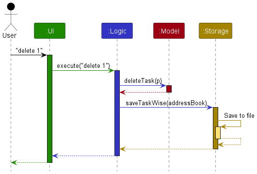

Each of the four main components (also shown in the diagram above),

* defines its *API* in an `interface` with the same name as the Component.
* implements its functionality using a concrete `{Component Name}Manager` class (which follows the corresponding API `interface` mentioned in the previous point.

For example, the `Logic` component defines its API in the `Logic.java` interface and implements its functionality using the `LogicManager.java` class which follows the `Logic` interface. Other components interact with a given component through its interface rather than the concrete class (reason: to prevent outside component's being coupled to the implementation of a component), as illustrated in the (partial) class diagram below.

The sections below give more details of each component.

### UI component

The **API** of this component is specified in [`Ui.java`](https://github.com/AY2324S1-CS2103T-T17-1/tp/tree/master/src/main/java/seedu/address/ui/Ui.java)

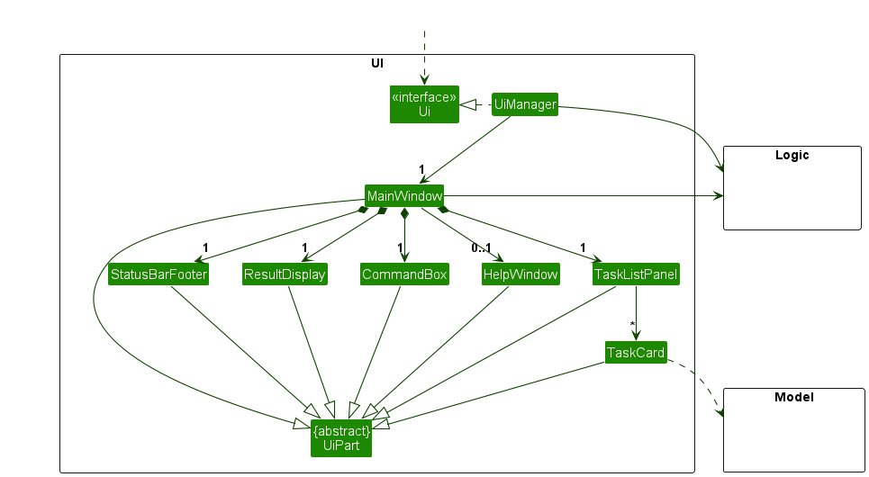

The UI consists of a `MainWindow` that is made up of parts e.g.`CommandBox`, `ResultDisplay`, `TaskListPanel`, `StatusBarFooter` etc. All these, including the `MainWindow`, inherit from the abstract `UiPart` class which captures the commonalities between classes that represent parts of the visible GUI.

The `UI` component uses the JavaFx UI framework. The layout of these UI parts are defined in matching `.fxml` files that are in the `src/main/resources/view` folder. For example, the layout of the [`MainWindow`](https://github.com/AY2324S1-CS2103T-T17-1/tp/tree/master/src/main/java/seedu/address/ui/MainWindow.java) is specified in [`MainWindow.fxml`](https://github.com/AY2324S1-CS2103T-T17-1/tp/tree/master/src/main/resources/view/MainWindow.fxml)

The `UI` component,

* executes user commands using the `Logic` component.
* listens for changes to `Model` data so that the UI can be updated with the modified data.
* keeps a reference to the `Logic` component, because the `UI` relies on the `Logic` to execute commands.
* depends on some classes in the `Model` component, as it displays `Task` objects residing in the `Model`.

### Logic component

**API** : [`Logic.java`](https://github.com/AY2324S1-CS2103T-T17-1/tp/tree/master/src/main/java/seedu/address/logic/Logic.java)

Here's a (partial) class diagram of the `Logic` component:

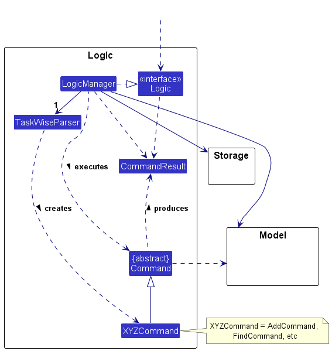

The sequence diagram below illustrates the interactions within the `Logic` component, taking `execute("delete 1")` API call as an example.

:information_source: **Note:** The lifeline for `DeleteCommandParser` should end at the destroy marker (X) but due to a limitation of PlantUML, the lifeline reaches the end of diagram.

How the `Logic` component works:

1. When `Logic` is called upon to execute a command, it is passed to a `TaskWiseParser` object which in turn creates a parser that matches the command (e.g., `DeleteCommandParser`) and uses it to parse the command.
1. This results in a `Command` object (more precisely, an object of one of its subclasses e.g., `DeleteCommand`) which is executed by the `LogicManager`.
1. The command can communicate with the `Model` when it is executed (e.g. to delete a person).
1. The result of the command execution is encapsulated as a `CommandResult` object which is returned back from `Logic`.

Here are the other classes in `Logic` (omitted from the class diagram above) that are used for parsing a user command:

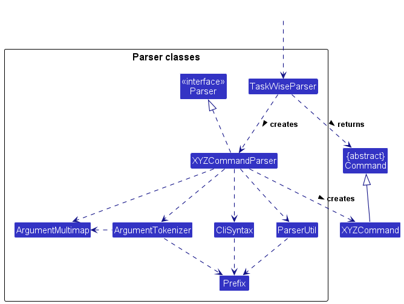

How the parsing works:

* When called upon to parse a user command, the `TaskWiseParser` class creates an `XYZCommandParser` (`XYZ` is a placeholder for the specific command name e.g., `AddCommandParser`) which uses the other classes shown above to parse the user command and create a `XYZCommand` object (e.g., `AddCommand`) which the `TaskWiseParser` returns back as a `Command` object.
* All `XYZCommandParser` classes (e.g., `AddCommandParser`, `DeleteCommandParser`, ...) inherit from the `Parser` interface so that they can be treated similarly where possible e.g, during testing.

### Model component

**API** : [`Model.java`](https://github.com/AY2324S1-CS2103T-T17-1/tp/tree/master/src/main/java/seedu/address/model/Model.java)

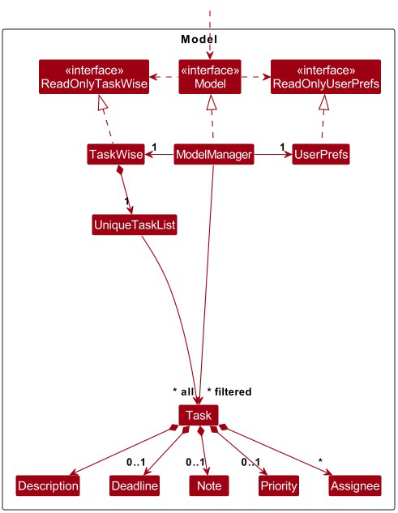

The `Model` component,

* stores the TaskWise data i.e., all `Task` objects (which are contained in a `UniqueTaskList` object).
* stores the currently 'selected' `Task` objects (e.g., results of a search query) as a separate _filtered_ list which is exposed to outsiders as an unmodifiable `ObservableList<Task>` that can be 'observed' e.g. the UI can be bound to this list so that the UI automatically updates when the data in the list change.
* stores a `UserPref` object that represents the user’s preferences. This is exposed to the outside as a `ReadOnlyUserPref` objects.
* does not depend on any of the other three components (as the `Model` represents data entities of the domain, they should make sense on their own without depending on other components).

Included inside the Task model are the following attributes:
* `Description`
    * Encapsulates a string attribute indicating the description of the task.
* `Status`
    * Encapsulates a boolean attribute indicating the completion status of the task containing that status instance.
* `Deadline`
    * Encapsulates a LocalDateTime object as an attribute, indicating a certain deadline for the task the Deadline object is associated with.
* `Note`
    * Encapsulates a string attribute indicating the additional information of the task containing the task.
* `Member`
    * A set of member instances, each encapsulating the name of the respective members assigned to the task.
* `Priority`
    * Encapsulates levels of priority as enumerations, highlighting the importance or urgency of the task it is associated with.

The attributes status, description and deadline are immutable classes.
Being immutable allows us to be consistent across editing a specific task and updating the status of the task through the mark/unmark commands. It also helps us to improve the clarity of whether a task is completed or incomplete.

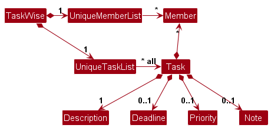

### Storage component

**API** : [`Storage.java`](https://github.com/AY2324S1-CS2103T-T17-1/tp/blob/master/src/main/java/seedu/address/storage/Storage.java)

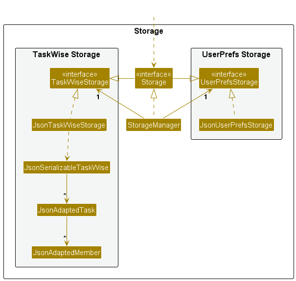

The `Storage` component,
* can save both TaskWise data and user preference data in JSON format, and read them back into corresponding objects.
* inherits from both `TaskWiseStorage` and `UserPrefStorage`, which means it can be treated as either one (if only the functionality of only one is needed).
* depends on some classes in the `Model` component (because the `Storage` component's job is to save/retrieve objects that belong to the `Model`)

### Common classes

Classes used by multiple components are in the `seedu.address.commons` package.

## Exception Handling

There are 3 main classes of Exceptions or Errors that are recognised by the application, namely the `CommandException`, `ParseException` and `StorageException` Exception classes. Most Exceptions or Errors that are thrown during normal operation of the app should extend from these 3 classes. Any other Exceptions or Errors that are thrown that do not extend from the prior 3 classes will **not** be caught and handled, and will instead be thrown back to the user.

Here is a quick overview of the 3 main Exception classes in TaskWise:

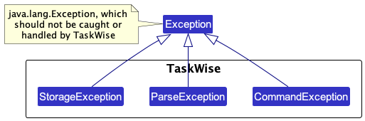

We shall now go through the 3 different classes of recognised Exceptions and Errors, before going through the other unrecognised Exceptions and Errors that may be thrown.

### `CommandException`

`CommandException` represents a generic error which occurred when a `Command` object is executed.

You are strongly discouraged from throwing this Exception class as a general catch-all exception when something went wrong when the user tries to execute a `Command`, as it may lack the necessary information which you need to find out what is wrong with the code and prevent you from debugging later on!

Should you find yourself requiring more Exception classes to handle any new errors that arises when you extend the app, create new Exception classes, extend from `CommandException`, and throw the new class instead!

There are *3* other derived classes of `CommandException`, which are the `DuplicatedTaskException`, `IllegalCommandException` and `IllegalTaskIndexException` classes. We shall explore the classes in detail in the next few sections.

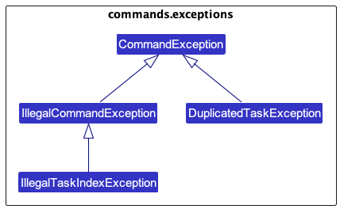

#### `DuplicatedTaskException`

This Exception is thrown when the user attempts to create a new Task with the same Task name as any Tasks already existing in their Task list.

This is due to the fact that duplicated Tasks are not permitted in the current version of the application.

#### `IllegalCommandException`

This Exception is thrown when the user attempts to do something that they do not have sufficient permission for, or are attempting to invoke undefined behaviour within TaskWise.

This Exception is meant to be a generic error which other Exceptions can extend from, but it may be thrown if necessary.

#### `IllegalTaskIndexException`

This Exception is thrown when the user attempts to input a Task index that is not permitted. This Exception extends from the above `IllegalCommandException`.

Some examples of task indices that are not permitted include: `-1` (negative indices), `10.0` (floating points) and `10` (when there is only `9` tasks in the task list).

#### `IllegalTaskStatusModificationException`

This Exception is thrown when the user attempts to mark a Task that is already completed, or unmark a task that is not completed.

For example, if a given Task is already marked as completed, when the user attempts to mark the Task again, this Exception will be thrown.

### `ParseException`

`ParseException` is another generic error which occurs when there was an issue encountered when a `Parser` tries to parse an input from the user. Usually, this error arises due to user error (e.g. wrong commands, invalid or illegal inputs), and should **not** be the result of developer error.

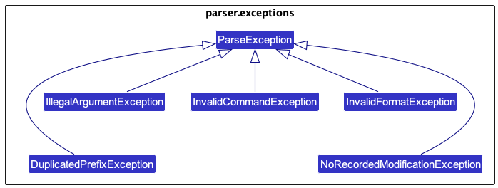

#### `DuplicatedPrefixException`

This Exception is thrown when the same `Prefix` is detected more than once in the same command.

For example, if the command `add t/task t/another task` is entered, the duplicated `t/` `Prefix` will be detected, and this Exception will be thrown.

#### `IllegalArgumentException`

This Exception is thrown when the user enters a valid command, but with invalid arguments. This Exception is mainly thrown by parsing methods found in `ParserUtil`, which handles the parsing of Task Index, Description, Tag, Sort Order and Sort Type.

#### `InvalidCommandException`

This Exception is thrown when the user attempts to execute a command that is not recognised by TaskWise.

Only commands recognised by TaskWise will be parsed and executed. Any unknown command will result in this Exception being thrown, alerting users that the input command they have entered is invalid.

#### `InvalidFormatException`

This Exception is thrown when the user inputs a command with essential arguments to the command missing.

An example of this would be the `add` command: `add` is invalid, and will result in this Exception being thrown.

#### `NoRecordedModificationException`

This Exception is thrown when the user indicates that they would like to edit a certain Task on their Task list, but failed to specify any changes made to said Task, i.e. they failed to properly modify the Task.

### `StorageException`

`StorageException` is the final class of generic error which occurs when there is an issue loading data from the save files of TaskWise.

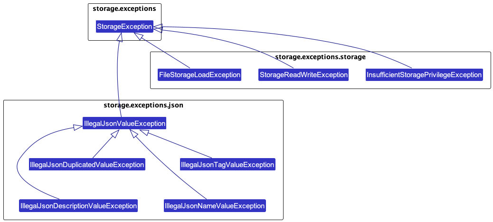

#### `IllegalJsonValueException`

This Exception is thrown when the data stored in TaskWise's JSON data files do not meet some constraints imposed by the Task model.

#### `IllegalJsonDescriptionValueException`

This Exception is thrown when the stored Task Description is corrupted and cannot be read from the JSON data file.

#### `IllegalJsonTagValueException`

This Exception is thrown when the stored Task Tags are corrupted and cannot be read from the JSON data file.

#### `IllegalJsonDuplicatedValueException`

This Exception is thrown when the JSON data file is illegally modified or corrupted, resulting in the inclusion of a duplicate Task.

#### `FileStorageLoadException`

This Exception is thrown when there are any issues encountered when loading data from any data files.

#### `InsufficientStoragePrivilegeException`

This Exception is thrown when the user failed to grant TaskWise sufficient access privilege to their file system, resulting in TaskWise being unable to read or write to the data files TaskWise creates while in operation.

#### `StorageReadWriteException`

This Exception is thrown when there is an error encountered when TaskWise is trying to read or write from the data files.

Note that this error differs from [`InsufficientStoragePrivilegeException`](#insufficientstorageprivilegeexception) in that access is granted, but the data file could not be recognised and hence parsed within TaskWise, hence leading to an error being raised.

### Unrecognised Exceptions

Any other Exceptions not mentioned above should not, under most circumstances, be thrown and not be handled by any method within TaskWise, as they will not be caught by TaskWise's internal Exception handling system, leading to the user's application crashing catastrophically.

Developers are recommended to extend the current Exception classes already provided to specify new Exceptions that they would like to handle, rather than throwing any Exceptions directly that are not on the list of pre-approved Exceptions, unless there is a legitimate reason to do so.

# Implementation

## General Implementation of Commands In TaskWise
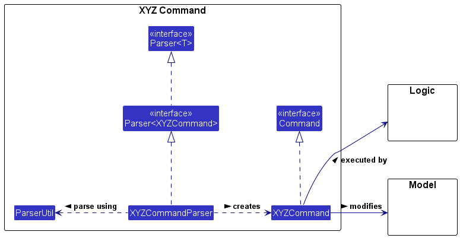

This class diagram is applicable for the following command: `Add`, `Mark`, `Unmark`, `Delete`, `Edit`, `Note`.

From the diagram, we are able to note some aspects of the command:

* `XYZCommand` follows the overall Facade design pattern that is used in TaskWise to dispatch commands to be executed.
  `XYZCommand` implements the `Command` interface, thereby allowing TaskWise to execute the Command without having to know what Command `XYZCommand` represents.
* `XYZCommandParser` does most of the heavy-lifting in preparing a XYZ Command for execution.
* Refer to the [`logic`](#logic-component) diagram and [`model`](#model-component) diagrams for more information regarding the `Logic` and `Model` classes and processes.

We can break down the class diagram further by analysing how XYZ Command is executed in TaskWise. Given below is the sequence diagram detailing the overall process of executing XYZ Command:

## Add Feature
The Add feature is facilitated by `TaskWise` which implements`ReadOnlyTaskWise`, stored internally as a `UniqueTaskList`. Additionally, it implements the `AddCommand#execute()` operation.

The process is given as such:

1. The user enters a `add` command into the CLI.
2. `LogicManager` receives the call to execute the input command via the `execute()` method.
3. `LogicManager` then parses the input command via the `parseCommand()` method, and dispatches the call to the correct `AddCommandParser`.
4. The created `AddCommandParser` then parses the parameters of the command via the `parse()` method.
5. If the parse is successful, a new instance of `AddCommand` with the relevant parsed parameters is created and returned to the caller.
6. The `AddCommand` object is then returned back to `LogicManager`, which invokes the `execute()` method of the `AddCommand` object.
    1. `AddCommand` will then call the `addTask()` method on `Model`, which will in turn call the `Task()` method on `TaskWise`, replacing the old `Task` with a new instance of the `Task` with the new task added.
    2. If the `Task` is already in the list, an exception is thrown to inform the user that they are attempting to add a `Task` that already exists.
    3. If the adding of the `Task` is successful, a new `CommandResult` object is then created and returned to the caller of the `AddCommand::execute()` method.
7. `LogicManager` receives the `CommandResult` object returned from the execution of the `AddCommand` and parses it
8. The execution of `AddCommand` terminates.

The following sequence diagram shows how the add operation works for `add t/Complete DG`:

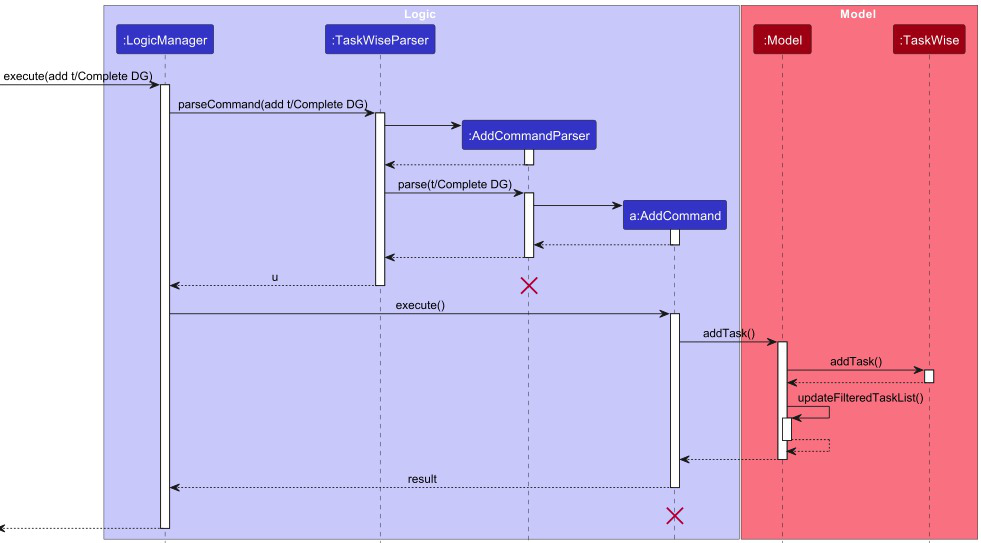

### Proposed Enhancements
The Add feature could allow for other *optional* attributes in the Task Model such as `deadline`, `priority`, `asignee` and `notes` to be added together with the task `description`.

An example of the enhanced `add` feature is: `add t/Complete DG d/26/10/2023 p/high` which adds the task with `description` Complete DG, `deadline` 26/10/2023 and `priority` high.

### Alternatives Considered:
We considered allowing the add feature to add `Notes`, `Assignee`, `Deadline`, and `Priority` at one go. However, we also needed to consider ease of use by user when entering all these attributes at one go using the `add` command. Therefore, we concluded that these 4 attributes should be optional to be entered all at once using `add`.

Only the `Description` has been made compulsory. The `Edit` feature will allow for users to add and update `Deadline`, `Priority`. The `Note` and `Assignee` features will allow for `assignee` and `note` to be added respectively.

## Mark Feature

The process is given as such:
1. The user enters a `mark` command into the CLI.
2. `LogicManager` receives the call to execute the input command via the `execute()` method.
3. `LogicManager` then parses the input command via the `parseCommand()` method, and dispatches the call to the correct `MarkCommandParser`.
4. The created `MarkCommandParser` then parses the parameters of the command via the `parse()` method.
5. If the parse is successful, a new instance of `MarkCommand` with the relevant parsed parameters is created and returned to the caller.
6. The `MarkCommand` object is then returned back to `LogicManager`, which invokes the `execute()` method of the `MarkCommand` object.
    1. `MarkCommand` will then call the `setTask()` method on `Model`, which will in turn call the `setTask()` method on `TaskWise`, replacing the old `Task` with a new instance of the `Task` with an updated completed status.
    2. If the existing `Task` is already marked as completed, an exception is thrown to inform the user that they are attempting to `mark` a `Task` already marked as completed.
    3. If the marking of the `Task` is successful, a new `CommandResult` object is then created and returned to the caller of the `MarkCommand::execute()` method.
7. `LogicManager` receives the `CommandResult` object returned from the execution of the `MarkCommand` and parses it.
8. The execution of `MarkCommand` terminates .

We implemented the `mark` command this way as we wanted to preserve the original architecture that was present in AddressBook3. Furthermore, by separating the `mark` command into multiple steps, involving multiple components that all handle different responsibilities, we believe that it satisfies the Single Responsibility principle.

Given below is the sequence diagram from when a user enters a `mark` command.

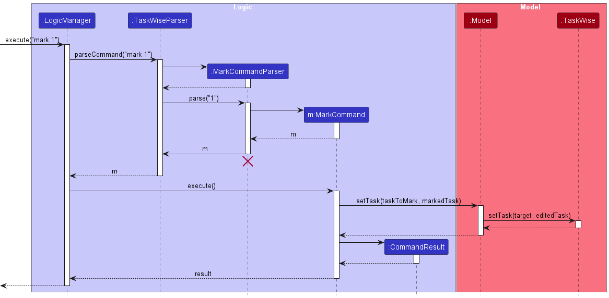

## Unmark Feature

The process is given as such:

1. The user enters a `unmark` command into the CLI.
2. `LogicManager` receives the call to execute the input command via the `execute()` method.
3. `LogicManager` then parses the input command via the `parseCommand()` method, and dispatches the call to the correct `UnmarkCommandParser`.
4. The created `UnmarkCommandParser` then parses the parameters of the command via the `parse()` method.
5. If the parse is successful, a new instance of `UnmarkCommand` with the relevant parsed parameters is created and returned to the caller.
6. The `UnmarkCommand` object is then returned back to `LogicManager`, which invokes the `execute()` method of the `UnmarkCommand` object.
    1. `UnmarkCommand` will then call the `setTask()` method on `Model`, which will in turn call the `setTask()` method on `TaskWise`, replacing the old `Task` with a new instance of the `Task` with an updated incomplete status.
    2. If the existing `Task` is already marked as incomplete, an exception is thrown to inform the user that they are attempting to `unmark` a `Task` already marked as incomplete.
    3. If the marking of the `Task` is successful, a new `CommandResult` object is then created and returned to the caller of the `UnmarkCommand::execute()` method.
7. `LogicManager` receives the `CommandResult` object returned from the execution of the `MarkCommand` and parses it.
8. The execution of `UnmarkCommand` terminates.

We implemented the `unmark` command this way as we wanted to preserve the original architecture that was present in AddressBook3. Furthermore, by separating the `unmark` command into multiple steps, involving multiple components that all handle different responsibilities, we believe that it satisfies the Single Responsibility principle.

Given below is the sequence diagram from when a user enters an `unmark` command.

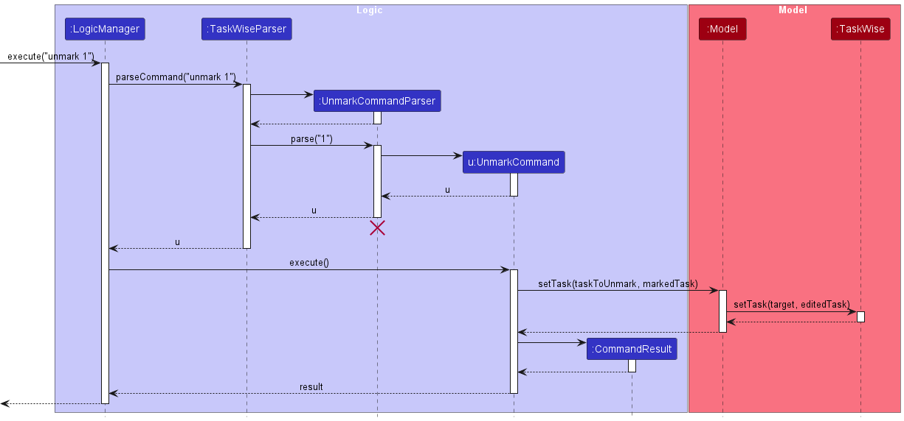

### Alternatives Considered:
Instead of having multiple components, we could have just had one `MarkCommand`/`UnmarkCommand` class and have that class be in charge of handling everything, from parsing the inputs from the user to modifying the model when the command is executed. However, we did not proceed with that plan, as doing so would create a `MarkCommand`/`UnmarkCommand` class that would have multiple responsibilities, which may lead to the singular `MarkCommand`/`UnmarkCommand` class requiring multiple changes when different, separate requirements change.

## Edit Feature - Adding Deadlines
The Edit feature is facilitated by `EditCommand` which extends `Command`.

The adding of `Deadline` to existing `Task` will be accomplished using the `EditCommand` class. When an `EditCommand` is executed, the `Task` at the specified index will be updated to contain a `Deadline` object containing information about the task's deadline.

### Proposed Enhancements
Possible enhancements could be allowing the user to add `Deadline` directly when the `Task` is being added.

## Edit Feature - Updating Priority of Existing Tasks

When Tasks are created, they have a `Priority` level of `NONE`. The updating of `Priority` to existing Tasks is accomplished using the `EditCommand` class. When the `EditCommand` is executed, their default `Priority` level of `NONE` is updated to the desired level of `LOW`, `MEDIUM` or `HIGH`.

### Proposed Enhancements
Possible enhancement for `Priority` is to allow users to `add` a task to the list with the `Priority` level specified at the `AddCommand` level. This way, users do not have to go through the extra step of updating the default `Priority` level of `NONE`.

## Sort Feature

Some attributes within the Tasks are comparable with each other as they implement the `java.lang.Comparable<T>` interface. These attributes are: `Description`, `Status`, `Deadline` and `Priority`.

:information_source: **Disclaimer:** Currently, only sorting by Task Description and Status is working, as the other attributes of Task are work-in-progress!

These comparable attributes form the basis on which this Sort Command is built upon. With these comparable attributes, we are able to sort the Task List using these attributes to obtain an ordered representation of the Task List.

The following diagram shows the association between classes necessary to achieving the sort feature:

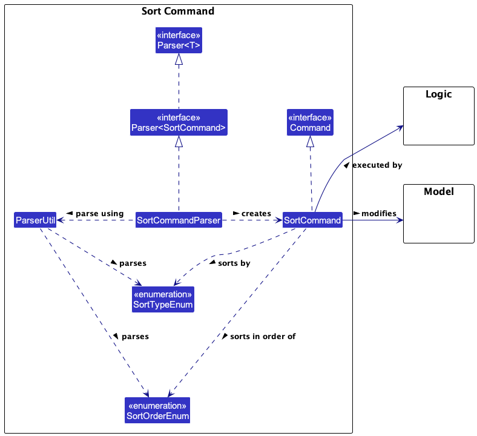

We can break down the class diagram further by analysing how the Sort Command is executed in TaskWise. Given below is the sequence diagram detailing the overall process of executing a Sort Command:

The process is given as such:

1. The user enters a sort command into the CLI.
2. `LogicManager` receives the call to execute the input command via the `execute()` method.
3. `LogicManager` then parses the input command via the `parseCommand()` method, and dispatches the call to the correct `SortCommandParser`.
4. The created `SortCommandParser` then parses the parameters of the command via the `parse()` method.
5. If the parse is successful, a new instance of `SortCommand` with the relevant parsed parameters are created and returned to the caller.
6. The `SortCommand` object is then returned back to `LogicManager`, which invokes the `execute()` method of the `SortCommand` object.
    1. Firstly, the `SortCommand` object makes a call to the `Model` using the method `getTaskWise()` and `getTaskList()`, returning the list of Tasks.
    2. The returned List of Tasks is then sorted using the aforementioned specified parameters.
    3. After the sort, `SortCommand` invokes the `setAllTasks()` method on `Model`, setting the internal filtered list of `Model` to the sorted Tasks.
    4. A new `CommandResult` object detailing the success of the sort command is then created and returned to the caller of the `SortCommand::execute()` method.
7. `LogicManager` receives the `CommandResult` object returned from the execution of the `SortCommand` and parses it.
8. The execution of `SortCommand` terminates.

### Alternatives Considered

We have considered not implementing this feature due to the overhead in code that we need to write and maintain within the codebase, and that enforcing comparability between different attributes of Task could prove challenging down the line when the project is extended and more attributes need to be considered to get a proper ordering of Tasks.

However, we have decided to implement the feature in the end, as we conclude that the benefits of providing users with a useful feature to help them organise their Tasks far outweighs the challenges we may face in the future when code needs to be maintained or extended.

To mitigate the problems that the extension of code may cause, we decided to implement the sorting parameters as Enums, hence allowing us as maintainers to easily extend the sort feature to new attributes added to Tasks with just a few lines of code.

### Proposed Enhancements

A possible enhancement for Sort would be to create new subclasses that extend directly from SortCommand, which represents the various specific sort sequences used to sort the Task List. While this may increase the amount of code written, it helps to increase extensibility of the sort feature and permit special sort sequences that cannot be defined by simple Enums.

## Note Feature

The Note feature is facilitated by the `Note Command` which extends `Command`.

Given below is the sequence diagram detailing the overall process of executing a Note Command:

The process is given as such:

1. The user enters a note command into the CLI.
2. `LogicManager` receives the call to execute the input command via the `execute()` method.
3. `LogicManager` then parses the input command via the `parseCommand()` method, and dispatches the call to the correct `NoteCommandParser`.
4. The created `NoteCommandParser` then parses the parameters of the command via the `parse()` method.
5. If the parse is successful, a new instance of `NoteCommand` with the relevant parsed parameters are created and returned to the caller.
6. The `NoteCommand` object is then returned back to `LogicManager`, which invokes the `execute()` method of the `NoteCommand` object.
    1. Then, `NoteCommand` invokes the `setTask()` method on `Model`, which in turns invoke the `setTask()` method on `TaskWise`, replacing the old Task with a new instance of the Task with the Note.
    2. A new `CommandResult` object detailing the success of the sort command is then created and returned to the caller of the `NoteCommand::execute()` method.
7. `LogicManager` receives the `CommandResult` object. returned from the execution of the `NoteCommand` and parses it.
8. The execution of `NoteCommand` terminates.

### Alternatives Considered

Initially, we were considering whether to make the requirement for `Note` as stringent as `Description`, where we strictly only accept alphanumeric characters. However we realized that there is a key different between `Note` and `Description` that makes `Note` less "strict" than `Description`, which is that a `Description` can never be empty while a `Note` can be empty. Thus we have decided to proceed with the less strict requirement for `Note`.

### Proposed Enhancements

Possible enhancement for Note is to allow users to add a task to the list with the Note specified at the AddCommand level if users already have something in mind to note. This way, users do not have to do it in separate steps.

## Assign Feature
Each instance of task will contain a set of members instances whereby the Member class will be an immutable class encapsulating the name of a group member.

To assign group members to a task, the project manager can do so using the following assign command as such `assign 1 a/John` which will assign John to the task at index 1.

The process is given as such:

1. The user enters a `assign` command into the CLI.
2. `LogicManager` receives the call to execute the input command via the `execute()` method.
3. `LogicManager` then parses the input command via the `parseCommand()` method, and dispatches the call to the correct `AssignCommandParser`.
4. The created `AssignCommandParser` then parses the parameters of the command via the `parse()` method.
5. If the parse is successful, a new instance of `AssignCommand` with the relevant parsed parameters is created and returned to the caller.
6. The `AssignCommand` object is then returned back to `LogicManager`, which invokes the `execute()` method of the `AssignCommand` object.
    1. `AssignCommand` will then call the `assignTask()` method on `Model`, which will in turn call the `Task()` method on `TaskWise`, replacing the old `Task` with a new instance of the `Task` with an updated task list with the task having an updated set of assignees.
    2. If the assignment to the `Task` is successful, a new `CommandResult` object is then created and returned to the caller of the `AssignCommand::execute()` method.
7. `LogicManager` receives the `CommandResult` object returned from the execution of the `AssignCommand` and parses it
8. The execution of `AssignCommand` terminates.

To remove the assigned members to a task, the project manager can use the edit command `edit 1 a/` whereby it will remove all assignees to the task at index 1.

The implementation of the attribute assignees to task is done using the Set data structure as it will help us handle the scenario where the project manager accidentally assign the same member to the task again. The group members' name will be encapsulated under the Member class as the sole attribute to ensure consistency with the other attributes.

### Alternatives considered
An alternative that was thought of for the Member class was to have an enum class containing the name of the different members. However, implementing this idea would make it difficult for us to handle the case where there are at least 2 group members of the exact same name, which would be deemed as duplicates in the enum class. Therefore, as an enhancement to this feature, we plan to store the group members in a json file, updating the json file when members are added into the group or left the group, retrieving the data the moment the application starts up.

### Proposed enhancement
1) Stores group member in a json file.
2) Assigning member based on index in json file.
3) Assignee class to also track the task that the member is assigned to.

# Documentation, Logging, Testing, Configuration and DevOps

* [Documentation guide](Documentation.md)
* [Testing guide](Testing.md)
* [Logging guide](Logging.md)
* [Configuration guide](Configuration.md)
* [DevOps guide](DevOps.md)

# Appendix: Requirements

## Product Scope

### Value Proposition

Provide the project manager of a CS2103T group a fast and intuitive CLI to manage their team project, by providing them a platform to manage different deadlines for different tasks, allowing them to be more on task and keep up with deadlines within one project.

### Target Audience

Our target audience of this application are Project Managers of CS2103T Group Projects.

## User Stories

| Priority | As a ...               | I want to ...                                                               | So that I can...                                     |
| -------- | ---------------------- | --------------------------------------------------------------------------- | ---------------------------------------------------- |
|  `* * *` | user                   | be able to add tasks to my list of tasks                                    | track tasks to be done                         |
|  `* * *` | project manager        | be able to delete tasks from my list of tasks                               | remove tasks that are completed or wrongly added     |
|  `* * *` | project manager        | be able to view all my tasks                                                | get a high level overview of what needs to be done   |
|  `* * *` | project manager        | be able to mark tasks that were unmarked                                    | update the progress of the task                      |
|  `* * *` | clumsy project manager | be able to unmark tasks that were marked in case I accidentally marked them | undo my mistake                                |
|  `* * *` | forgetful manager      | be told that I have entered an invalid command                              | be informed if the command I entered is invalid |
|  `* *` | project manager        | be able to assign deadlines to tasks                              |  know when I need to finish the task by |
|  `* *` | forgetful team member        | have a project manager who can track what tasks I need to do                              | be on track for deliverables |
`* *`| busy project manager| be able to see the task's level of priority| be aware of what the team and I need to prioritise and do next|
|`* *`|forgetful project manager|be able to add additional information relevant to my tasks|manage my tasks without missing out important details|
| `* *`| timely project manager | be able to group my tasks by priorities, deadlines, completion status and task names | better track the tasks are that important to my project | 

## Use Cases
### UC01: Add a task
Actor(s): Project Manager  
Guarantees:
* A task is added into the system list of tasks.

**MSS**

1. User inputs command to add a task.
2. System adds the task into list of task and <u>[displays the updated task list (UC03)](#UC03-View-all-tasks)</u>.

Use case ends.

**Extensions:**
1a. User enters an illegal command.  
&ensp;&ensp;1a1. System warns that the <u>[command is illegal (UC07)](#UC07-Warn-on-Illegal-Command)</u>.  
&ensp;&ensp;1a2. User acknowledges the warning.

Use case ends.

### UC02: Delete a task
Actor(s): Project Manager  
Guarantees:
* The specified task is successfully deleted from the system.

**MSS**

1. User inputs command to delete a certain task.
2. System deletes the task and <u>[displays the updated task list (UC03)](#UC03-View-all-tasks)</u>.

Use case ends.

**Extensions:**
1a. User enters an invalid command.  
&ensp;&ensp;1a1. System warns that the <u>[command is invalid (UC06)](#UC06-Warn-on-Invalid-Command)</u>.  
&ensp;&ensp;1a2. User acknowledges the warning.  
1b. User enters an illegal command.  
&ensp;&ensp;1b1. System warns that the <u>[command is illegal (UC07)](#UC07-Warn-on-Illegal-Command)</u>.  
&ensp;&ensp;1b2. User acknowledges the warning.

Use case ends.

### UC03: View all tasks

Actor(s): Project Manager

**MSS**

1. User opens up the application.
2. System displays a list of tasks to the user.

Use case ends.

**Extensions:**
1a. User enters an invalid command.  
&ensp;&ensp;1a1. System warns that the <u>[command is invalid (UC06)](#UC06-Warn-on-Invalid-Command)</u>.  
&ensp;&ensp;1a2. User acknowledges the warning.

Use case ends.

### UC04: Marks a task as done

Actor(s): Project Manager  
Guarantees:
* The specified task is successfully marked as complete in the system.

**MSS**

1. User inputs command to mark a certain task as done.
2. System updates and marks the task as done.
3. Updated list of tasks is <u>[displayed to the user (UC03)](#UC03-View-all-tasks)</u>.

Use case ends.

**Extensions:**
1a. User enters an invalid command.  
&ensp;&ensp;1a1. System warns that the <u>[command is invalid (UC06)](#UC06-Warn-on-Invalid-Command)</u>.  
&ensp;&ensp;1a2. User acknowledges the warning.  
1b. User enters an illegal command.  
&ensp;&ensp;1b1. System warns that the <u>[command is illegal (UC07)](#UC07-Warn-on-Illegal-Command)</u>.  
&ensp;&ensp;1b2. User acknowledges the warning.

Use case ends.

### UC05: Unmarks a task that was marked as done

Actor(s): Project Manager  
Guarantees:
* The specified task is successfully marked as incomplete in the system.

**MSS**
1. User inputs command to unmark certain task.
2. System updates and marks the task as incomplete.
3. Updated list of tasks is <u>[displayed to the user (UC03)](#UC03-View-all-tasks)</u>.

Use case ends.

**Extensions:**
1a. User enters an invalid command.  
&ensp;&ensp;1a1. System warns that the <u>[command is invalid (UC06)](#UC06-Warn-on-Invalid-Command)</u>.  
&ensp;&ensp;1a2. User acknowledges the warning.  
1b. User enters an illegal command.  
&ensp;&ensp;1b1. System warns that the <u>[command is illegal (UC07)](#UC07-Warn-on-Illegal-Command)</u>.  
&ensp;&ensp;1b2. User acknowledges the warning.

Use case ends.

### UC06: Warn on invalid command

Actor(s): Project Manager, System  
Guarantee(s):
* No commands will be executed.

**MSS**

1. User inputs an invalid command.
2. System warns user that the command entered is invalid.

Use case ends.

### UC07: Warn on illegal command

Actor(s): Project Manager, System  
Guarantee(s):
* Illegal command will not be executed.

**MSS**

1. User inputs an illegal command (valid command but the user has no permission to execute the command or argument is invalid).
2. System warns user that the command entered is illegal and cannot be completed.

Use case ends.

### UC08: Add a deadline to an existing task
Actor(s): Project Manager  
Guarantees:
* A deadline is added to an existing task in the list of tasks.

**MSS**

1. User inputs command to add a deadline to an existing task.
2. System updates and adds the deadline to the specified task.
3. Updated list of tasks is <u>[displayed to the user (UC03)](#UC03-View-all-tasks)</u>.

Use case ends.

**Extensions:**

1a. User enters an invalid command.  
&ensp;&ensp;1a1. System warns that the <u>[command is invalid (UC06)](#UC06-Warn-on-Invalid-Command)</u>.  
&ensp;&ensp;1a2. User acknowledges the warning.  
1b. User enters an illegal command.  
&ensp;&ensp;1b1. System warns that the <u>[command is illegal (UC07)](#UC07-Warn-on-Illegal-Command)</u>.  
&ensp;&ensp;1b2. User acknowledges the warning.

Use case ends.

### UC09: Assign members to an existing task
Actor(s): Project Manager  
Guarantees:
* The specified member is assigned to the existing task

**MSS**

1. User inputs command to assign member to an existing task.
2. System assigns member to the existing task.
3. Updated list of tasks is <u>[displayed to the user (UC03)](#UC03-View-all-tasks)</u>.

Use case ends.

**Extensions:**

1a. User enters an invalid command.  
&ensp;&ensp;1a1. System warns that the <u>[command is invalid (UC06)](#UC06-Warn-on-Invalid-Command)</u>.  
&ensp;&ensp;1a2. User acknowledges the warning.  
1b. User enters an illegal command.  
&ensp;&ensp;1b1. System warns that the <u>[command is illegal (UC07)](#UC07-Warn-on-Illegal-Command)</u>.  
&ensp;&ensp;1b2. User acknowledges the warning.

Use case ends.

### UC10: Update priority of an existing task
Actor(s): Project Manager  
Guarantees:
* The default priority level of NONE is updated to either LOW, MEDIUM or HIGH for an existing task.

**MSS**

1. User inputs command to update the priority of an existing task.
2. System updates the priority level of the specified task.
3. Updated list of task with priority level is <u>[displayed to the user (UC03)](#UC03-View-all-tasks)</u>.

Use case ends.

**Extensions:**

1a. User enters an invalid command.  
&ensp;&ensp;1a1. System warns that the <u>[command is invalid (UC06)](#UC06-Warn-on-Invalid-Command)</u>.  
&ensp;&ensp;1a2. User acknowledges the warning.  
1b. User enters an illegal command.  
&ensp;&ensp;1b1. System warns that the <u>[command is illegal (UC07)](#UC07-Warn-on-Illegal-Command)</u>.  
&ensp;&ensp;1b2. User acknowledges the warning.

Use case ends.

### UC11: Add note to a task
Actor(s): Project Manager  
Guarantees:
* The note is added to the task.

**MSS**

1. User inputs command to add note to an existing task.
2. System updates the task to include the note.
3. Updated list of task with note is <u>[displayed to the user (UC03)](#UC03-View-all-tasks)</u>.

Use case ends.

**Extensions:**

1a. User enters an invalid command.  
&ensp;&ensp;1a1. System warns that the <u>[command is invalid (UC06)](#UC06-Warn-on-Invalid-Command)</u>.  
&ensp;&ensp;1a2. User acknowledges the warning.  
1b. User enters an illegal command.  
&ensp;&ensp;1b1. System warns that the <u>[command is illegal (UC07)](#UC07-Warn-on-Illegal-Command)</u>.  
&ensp;&ensp;1b2. User acknowledges the warning.

Use case ends.

### UC12: Sort tasks in task list

Actor(s): Project Manager
Guarantees:
* If the sort is successful, the order of the Tasks on display will be changed(unless the Task List is already sorted)
* No matter if the order of the Task List changes or otherwise, all existing Tasks will be reassigned to the Task List

**MSS**

1. User inputs command to sort the Task List.
2. System parses the command and sorts the Task List.
3. Updated list of task is <u>[displayed to the user (UC03)](#UC03-View-all-tasks)</u>

Use case ends.

**Extensions:**

1a. User enters an invalid command.  
&ensp;&ensp;1a1. System warns that the <u>[command is invalid (UC06)](#UC06-Warn-on-Invalid-Command)</u>.  
&ensp;&ensp;1a2. User acknowledges the warning.  
1b. User enters an illegal command.  
&ensp;&ensp;1b1. System warns that the <u>[command is illegal (UC07)](#UC07-Warn-on-Illegal-Command)</u>.  
&ensp;&ensp;1b2. User acknowledges the warning.

Use case ends.

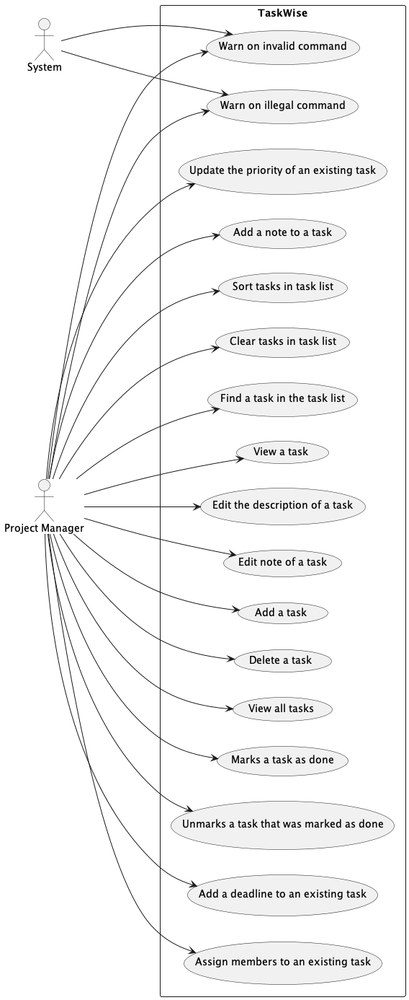

## Non-Functional Requirements

1. TaskWise should work on Windows/MacOS/Linux as long as the device has `Java 11` or above installed.
2. A user should be able to accomplish all of the tasks using commands rather than using a mouse.
3. The size of the JAR file should not be larger than 100 MB.
4. TaskWise should work without Internet connectivity.

## Glossary

* **Argument**: A word or number or a sequence of words or numbers that represent.
* **CLI**: A Command Line Interface is a text-based interface where users can interact with the software by typing commands.
* **Command**: A sequence of words that represents an action that TaskWise can understand and execute.
* **Deadline**: A class that represents the date that the task needs to be completed by.
* **Field**: Refers to the `Status`, `Deadline`, `Priority`, `Description`, `Member` of a Task.
* **GUI**: A Graphical User Interface is a visual interface where users can interact with the software through on-screen elements like buttons and windows.
* **JAR**: A file that contains all the resources needed for TaskWise to run.
* **Java**: A general-purpose programming language which TextWise is built on.
* **Member**: A class that represents the name of the project's group member(s).
* **Note**: A class that represents the additional string of information that you want to attach to a task
* **Priority**: A class that represents the priority level of the task.
* **Sort Order**: The ascending or descending order to sort the Task List by
* **Sort Type**: The fields within Task used to sort the Task List by
* **Status**: A class that represents whether a task is completed or not.
* **System**: The TaskWise program.
* **Task**: A Task is a completable objective with or without deadline.
