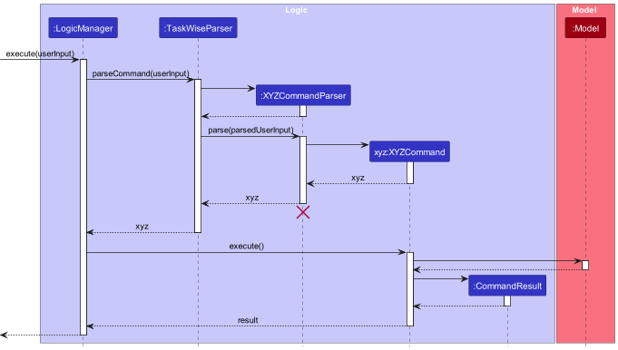
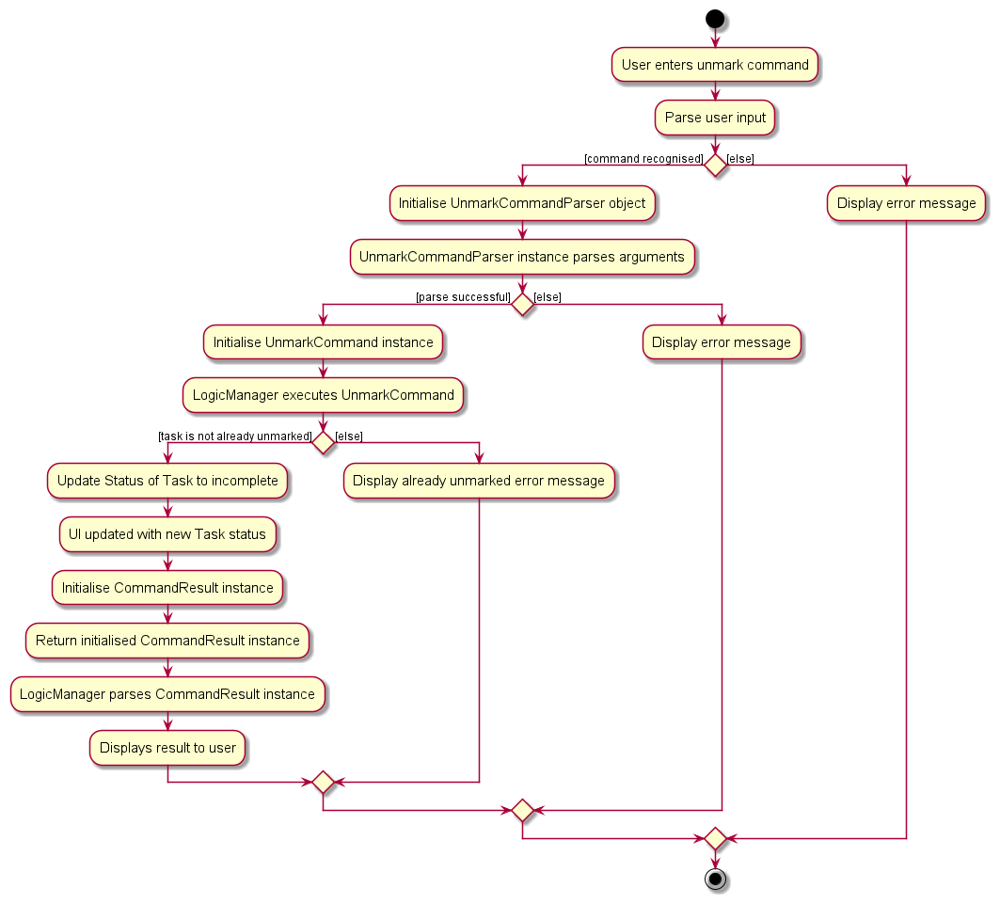
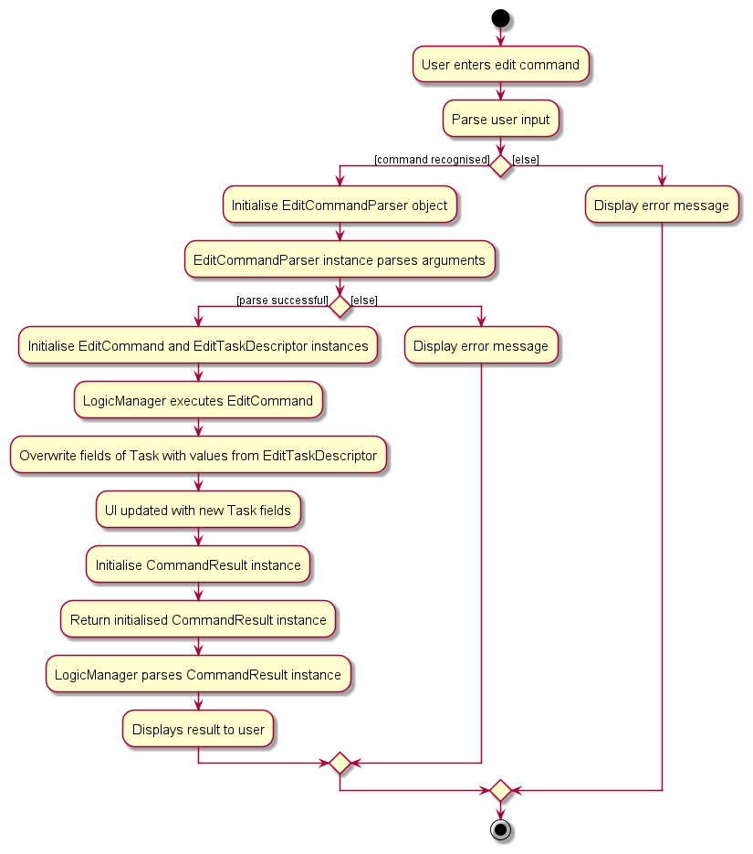

Welcome to the TaskWise Developer Guide!

## Content

- [Acknowledgements](#acknowledgements)
- [Introduction](#introduction)
- [Getting Started](#getting-started)
- [Design](#design)
    - [Architecture](#architecture)
        - [UI Component](#ui-component)
        - [Logic Component](#logic-component)
        - [Model Component](#model-component)
        - [Storage Component](#storage-component)
        - [Common Classes](#common-classes)
    - [Exception Handling](#exception-handling)
- [Implementation](#implementation)
    - [Add Feature](#add-feature)
    - [Mark Feature](#mark-feature)
    - [Unmark Feature](#unmark-feature)
    - [Edit Feature](#edit-feature)
        - [Adding Deadlines](#adding-deadlines)
        - [Updating Description](#updating-description)
        - [Updating Priority of Existing Tasks](#updating-priority-of-existing-tasks)
        - [Assigning Members to Existing Tasks](#assigning-members-to-existing-tasks)
        - [Updating Note](#updating-note)
    - [Sort Feature](#sort-feature)
    - [Note Feature](#note-feature)
    - [View Feature](#view-feature)
    - [Find Feature](#find-feature)
    - [List Feature](#list-feature)
    - [Delete Feature](#delete-feature)
    - [Clear Feature](#clear-feature)
- [Documentation, Logging, Testing, Configuration and DevOps](#documentation-logging-testing-configuration-and-devops)
- [Appendix: Requirements](#appendix-requirements)
    - [Product Scope](#product-scope)
        - [Value Proposition](#value-proposition)
        - [Target Audience](#target-audience)
    - [User Stories](#user-stories)
    - [Use Cases](#use-cases)
    - [Non-Functional Requirements](#non-functional-requirements)
    - [Glossary](#glossary)
- [Appendix: Planned Enhancements](#appendix-planned-enhancements)
    - [Adding Tasks With Same Description and Different Other Parameters](#adding-tasks-with-same-description-and-different-other-parameters)
    - [Better Clarity Regarding Deadlines That Have Passed](#better-clarity-regarding-deadlines-that-have-passed)
    - [Different Modes of Edit Command](#different-modes-of-edit-command)
        - [Append Mode](#append-mode)
        - [Edit Mode](#edit-mode)
        - [Overwrite Mode](#overwrite-mode)
    - [Improve Find Command To Find By Priority, Deadline, Members and Notes](#improve-find-command-to-find-by-priority-deadline-members-and-notes)
    - [Case-insensitive Sort](#case---insensitive-sort)
    - [Case-insensitive Ordering of Members](#case---insensitive-ordering-of-members)
- [Appendix: Instructions for Manual Testing](#appendix-instructions-for-manual-testing)
- [Appendix: Effort](#appendix-effort)

# Acknowledgements

This project was built on top of the existing [AddressBook Level 3 Code from SE-EDU](https://github.com/se-edu/addressbook-level3).

Apart from that, we reused some code from other sources:

* Libraries used:
    * [JavaFX](https://openjfx.io/)
    * [Jackson](https://github.com/FasterXML/jackson)
    * [JUnit5](https://github.com/junit-team/junit5)
* Code Reused:
    * [StackOverflow](https://stackoverflow.com/)
        * [Implementing Global Key Strokes Recognition](https://copyprogramming.com/howto/implementing-a-global-key-press-for-javafx-methods)
        * [Defining Behaviours When ListView Cells are Clicked](https://stackoverflow.com/questions/52184611/javafx-keep-oldvalue-and-newvalue-of-listview-the-same-when-condition-has-not-b)
    * [ChatGPT](https://chat.openai.com/)
        * Generating Regex strings used for DateTime parsing
    * [Regex101](https://regex101.com/)
        * Building and Testing Regex strings generated by ChatGPT

# Introduction

Welcome to the TaskWise Developer Guide!

Through this guide, you will learn more about the vision behind TaskWise, how TaskWise was built and how you as a Developer can use TaskWise and build upon it!

# Getting Started

Before you begin your development journey in TaskWise, make sure that you meet the minimum requirements needed to run TaskWise on your development device!

## Minimum Requirements

TaskWise uses Java 11 with JavaFX. If you are not sure how to install Java 11 and JavaFX, refer to [this guide](#UserGuide.html#installation-guide) in the User Guide to install and start TaskWise.

:warning: This step is crucial to ensure that the features you develop will work well with other components in TaskWise!

## What's Next?

Now that you have installed Java 11 and JavaFX, you may wish to start developing new features or fix bugs that exist in TaskWise!

Refer to the [Design section](#design) to get a clearer view of how TaskWise is built, and how you can get started in developing new components to integrate into TaskWise!

Looking for more information on the existing features of TaskWise? Refer to the [Implementation section](#implementation) to get up to date with the implementation of existing features within TaskWise!

Want more information on how we built TaskWise, and how you can use our workflows in your own project? Refer to the [Documentation, Logging, Testing, Configuration and DevOps section](#documentation-logging-testing-configuration-and-devops) for more information on how we documented, tested and developed TaskWise, and how you can integrate our workflows into your own!

Unclear on why we built TaskWise? Head over to the [Appendix: Requirements Section](#appendix-requirements) for a clearer picture of what was on our minds when we developed TaskWise, and how TaskWise was built with the end user's needs in mind!

# Design

The following segment describes the internal structure of TaskWise.

## Architecture

The ***Architecture Diagram*** given above explains the high-level design of the App.

Given below is a quick overview of the main components and how they interact with each other.

**Main components of the architecture**

**`Main`** (consisting of classes [`Main`](https://github.com/AY2324S1-CS2103T-T17-1/tp/blob/master/src/main/java/seedu/address/Main.java) and [`MainApp`](https://github.com/AY2324S1-CS2103T-T17-1/tp/blob/master/src/main/java/seedu/address/MainApp.java)) is in charge of the app launch and shut down.
* At app launch, it initializes the other components in the correct sequence, and connects them up with each other.
* At shutdown, it shuts down the other components and invokes cleanup methods where necessary.

The bulk of the app's work is done by the following four components:

* [**`UI`**](#ui-component): The UI of the App.
* [**`Logic`**](#logic-component): The command executor.
* [**`Model`**](#model-component): Holds the data of the App in memory.
* [**`Storage`**](#storage-component): Reads data from, and writes data to, the hard disk.

[**`Commons`**](#common-classes) represents a collection of classes used by multiple other components.

**How the architecture components interact with each other**

The *Sequence Diagram* below shows how the components interact with each other for the scenario where the user issues the command `delete 1`.

Each of the four main components (also shown in the diagram above),

* defines its *API* in an `interface` with the same name as the Component.
* implements its functionality using a concrete `{Component Name}Manager` class (which follows the corresponding API `interface` mentioned in the previous point.

For example, the `Logic` component defines its API in the `Logic.java` interface and implements its functionality using the `LogicManager.java` class which follows the `Logic` interface. Other components interact with a given component through its interface rather than the concrete class (reason: to prevent outside components' being coupled to the implementation of a component), as illustrated in the (partial) class diagram below.

The sections below give more details of each component.

### UI Component

The **API** of this component is specified in [`Ui.java`](https://github.com/AY2324S1-CS2103T-T17-1/tp/tree/master/src/main/java/seedu/address/ui/Ui.java)

The UI consists of a `MainWindow` that is made up of parts e.g.`CommandBox`, `ResultDisplay`, `TaskListPanel`, `StatusBarFooter` etc. All these, including the `MainWindow`, inherit from the abstract `UiPart` class which captures the commonalities between classes that represent parts of the visible GUI.

The `UI` component uses the JavaFX UI framework. The layout of these UI parts is defined in matching `.fxml` files that are in the `src/main/resources/view` folder. For example, the layout of the [`MainWindow`](https://github.com/AY2324S1-CS2103T-T17-1/tp/tree/master/src/main/java/seedu/address/ui/MainWindow.java) is specified in [`MainWindow.fxml`](https://github.com/AY2324S1-CS2103T-T17-1/tp/tree/master/src/main/resources/view/MainWindow.fxml).

The `UI` component,

* executes user commands using the `Logic` component.
* listens for changes to `Model` data so that the UI can be updated with the modified data.
* keeps a reference to the `Logic` component, because the `UI` relies on the `Logic` to execute commands.
* depends on some classes in the `Model` component, as it displays `Task` objects residing in the `Model`.

### Logic Component

**API** : [`Logic.java`](https://github.com/AY2324S1-CS2103T-T17-1/tp/tree/master/src/main/java/seedu/address/logic/Logic.java)

Here's a (partial) class diagram of the `Logic` component:

The sequence diagram below illustrates the interactions within the `Logic` component, taking `execute("delete 1")` API call as an example.

:information_source: **Note:** The lifeline for `DeleteCommandParser` should end at the destroy marker (X) but due to a limitation of PlantUML, the lifeline reaches the end of diagram.

How the `Logic` component works:

1. When `Logic` is called upon to execute a command, it is passed to a `TaskWiseParser` object which in turn creates a parser that matches the command (e.g., `DeleteCommandParser`) and uses it to parse the command.
1. This results in a `Command` object (more precisely, an object of one of its subclasses e.g., `DeleteCommand`) which is executed by the `LogicManager`.
1. The command can communicate with the `Model` when it is executed (e.g. to delete a person).
1. The result of the command execution is encapsulated as a `CommandResult` object which is returned back from `Logic`.

Here are the other classes in `Logic` (omitted from the class diagram above) that are used for parsing a user command:

How the parsing works:

* When called upon to parse a user command, the `TaskWiseParser` class creates an `XYZCommandParser` (`XYZ` is a placeholder for the specific command name e.g., `AddCommandParser`) which uses the other classes shown above to parse the user command and create a `XYZCommand` object (e.g., `AddCommand`) which the `TaskWiseParser` returns back as a `Command` object.
* All `XYZCommandParser` classes (e.g., `AddCommandParser`, `DeleteCommandParser`, ...) inherit from the `Parser` interface so that they can be treated similarly where possible e.g, during testing.

### Model Component

**API** : [`Model.java`](https://github.com/AY2324S1-CS2103T-T17-1/tp/tree/master/src/main/java/seedu/address/model/Model.java)

The `Model` component,

* stores the TaskWise data i.e., all `Task` objects (which are contained in a `UniqueTaskList` object).
* stores the currently 'selected' `Task` objects (e.g., results of a search query) as a separate _filtered_ list which is exposed to outsiders as an unmodifiable `ObservableList<Task>` that can be 'observed' e.g. the UI can be bound to this list so that the UI automatically updates when the data in the list change.
* stores a `UserPref` object that represents the user’s preferences. This is exposed to the outside as a `ReadOnlyUserPref` objects.
* does not depend on any of the other three components (as the `Model` represents data entities of the domain, they should make sense on their own without depending on other components).

Included inside the Task model are the following attributes:
* `Description`
    * Encapsulates a string attribute indicating the description of the task.
* `Status`
    * Encapsulates a boolean attribute indicating the completion status of the task containing that status instance.
* `Deadline`
    * Encapsulates a LocalDateTime object as an attribute, indicating a certain deadline for the task the Deadline object is associated with.
* `Note`
    * Encapsulates a string attribute indicating the additional information of the task containing the task.
* `Members`
    * A set of member instances, each encapsulating the name of the respective members assigned to the task.
* `Priority`
    * Encapsulates levels of priority as enumerations, highlighting the importance or urgency of the task it is associated with.

The attributes status, description and deadline are immutable classes.
Being immutable allows us to be consistent across editing a specific task and updating the status of the task through the mark/unmark commands. It also helps us to improve the clarity of whether a task is completed or incomplete.

### Storage Component

**API** : [`Storage.java`](https://github.com/AY2324S1-CS2103T-T17-1/tp/blob/master/src/main/java/seedu/address/storage/Storage.java)

The `Storage` component,
* can save both TaskWise data and user preference data in JSON format, and read them back into corresponding objects.
* inherits from both `TaskWiseStorage` and `UserPrefStorage`, which means it can be treated as either one (if only the functionality of only one is needed).
* depends on some classes in the `Model` component (because the `Storage` component's job is to save/retrieve objects that belong to the `Model`.

### Common Classes

Classes used by multiple components are in the `seedu.address.commons` package.

## Exception Handling

There are 3 main classes of Exceptions or Errors that are recognised by the application, namely the `CommandException`, `ParseException` and `StorageException` Exception classes. Most Exceptions or Errors that are thrown during normal operation of the app should extend from these 3 classes. Any other Exceptions or Errors that are thrown that do not extend from the prior 3 classes will **not** be caught and handled, and will instead be thrown back to the user.

Here is a quick overview of the 3 main Exception classes in TaskWise:

We shall now go through the 3 different classes of recognised Exceptions and Errors, before going through the other unrecognised Exceptions and Errors that may be thrown.

### `CommandException`

`CommandException` represents a generic error which occurs when a `Command` object is executed.

You are strongly discouraged from throwing this Exception class as a general catch-all exception when something goes wrong when the user tries to execute a `Command`, as it may lack the necessary information which you need to find out what is wrong with the code and prevent you from debugging later on!

Should you find yourself requiring more Exception classes to handle any new errors that arise when you extend the app, create new Exception classes, extend from `CommandException`, and throw the new class instead!

There are *3* other derived classes of `CommandException`, which are the `DuplicatedTaskException`, `IllegalCommandException` and `IllegalTaskIndexException` classes. We shall explore the classes in detail in the next few sections.

#### `DuplicatedTaskException`

This Exception is thrown when the user attempts to create a new Task with the same Task name as any Tasks already existing in their Task list.

This is due to the fact that duplicated Tasks are not permitted in the current version of the application.

#### `IllegalCommandException`

This Exception is thrown when the user attempts to do something that they do not have sufficient permission for, or are attempting to invoke undefined behaviour within TaskWise.

This Exception is meant to be a generic error which other Exceptions can extend from, but it may be thrown if necessary.

#### `IllegalTaskIndexException`

This Exception is thrown when the user attempts to input a Task index that is not permitted. This Exception extends from the above `IllegalCommandException`.

Some examples of task indices that are not permitted include: `-1` (negative indices), `10.0` (floating points) and `10` (when there is only `9` tasks in the task list).

#### `IllegalTaskStatusModificationException`

This Exception is thrown when the user attempts to mark a Task that is already completed or unmark a task that is not completed.

For example, if a given Task is already marked as completed when the user attempts to mark the Task again, this Exception will be thrown.

### `ParseException`

`ParseException` is another generic error which occurs when there w is issue encountered when a `Parser` tries to parse an input from the user. Usually, this error arises due to user error (e.g. wrong commands, invalid or illegal inputs), and should **not** be the result of developer error.

#### `DuplicatedPrefixException`

This Exception is thrown when the same `Prefix` is detected more than once in the same command.

For example, if the command `add t/task t/another task` is entered, the duplicated `t/` `Prefix` will be detected, and this Exception will be thrown.

#### `IllegalArgumentException`

This Exception is thrown when the user enters a valid command but with invalid arguments. This Exception is mainly thrown by parsing methods found in `ParserUtil`, which handles the parsing of Task Index, Description, Tag, Sort Order and Sort Type.

#### `InvalidCommandException`

This Exception is thrown when the user attempts to execute a command that is not recognised by TaskWise.

Only commands recognised by TaskWise will be parsed and executed. Any unknown command will result in this Exception being thrown, alerting users that the input command they have entered is invalid.

#### `InvalidFormatException`

This Exception is thrown when the user inputs a command with essential arguments to the command missing.

An example of this would be the `add` command: `add` is invalid, and will result in this Exception being thrown.

#### `NoRecordedModificationException`

This Exception is thrown when the user indicates that they would like to edit a certain Task on their Task list, but failed to specify any changes made to said Task, i.e. they failed to properly modify the Task.

### `StorageException`

`StorageException` is the final class of generic error which occurs when there is an issue loading data from the save files of TaskWise.

#### `IllegalJsonValueException`

This Exception is thrown when the data stored in TaskWise's JSON data files do not meet some constraints imposed by the Task model.

#### `IllegalJsonDescriptionValueException`

This Exception is thrown when the stored Task Description is corrupted and cannot be read from the JSON data file.

#### `IllegalJsonTagValueException`

This Exception is thrown when the stored Task Tags are corrupted and cannot be read from the JSON data file.

#### `IllegalJsonDuplicatedValueException`

This Exception is thrown when the JSON data file is illegally modified or corrupted, resulting in the inclusion of a duplicate Task.

#### `FileStorageLoadException`

This Exception is thrown when there are any issues encountered when loading data from any data files.

#### `InsufficientStoragePrivilegeException`

This Exception is thrown when the user fails to grant TaskWise sufficient access privilege to their file system, resulting in TaskWise being unable to read or write to the data files TaskWise creates while in operation.

#### `StorageReadWriteException`

This Exception is thrown when there is an error encountered when TaskWise is trying to read or write from the data files.

Note that this error differs from [`InsufficientStoragePrivilegeException`](#insufficientstorageprivilegeexception) in that access is granted, but the data file could not be recognised and hence parsed within TaskWise, hence leading to an error being raised.

### Unrecognised Exceptions

Any other Exceptions not mentioned above should not, under most circumstances, be thrown and not be handled by any method within TaskWise, as they will not be caught by TaskWise's internal Exception handling system, leading to the user's application crashing catastrophically.

Developers are recommended to extend the current Exception classes already provided to specify new Exceptions that they would like to handle, rather than throwing any Exceptions directly that are not on the list of pre-approved Exceptions unless there is a legitimate reason to do so.

# Implementation

## General Implementation of Commands In TaskWise

This class diagram is applicable for the following commands: `Add`, `Mark`, `Unmark`, `Delete`, `Edit`, `Note`.

From the diagram, we are able to note some aspects of the command:

* `XYZCommand` follows the overall Facade design pattern that is used in TaskWise to dispatch commands to be executed.
  `XYZCommand` implements the `Command` interface, thereby allowing TaskWise to execute the Command without having to know what Command `XYZCommand` represents.
* `XYZCommandParser` does most of the heavy lifting in preparing a XYZ Command for execution.
* Refer to the [`logic`](#logic-component) diagram and [`model`](#model-component) diagrams for more information regarding the `Logic` and `Model` classes and processes.

We can break down the class diagram further by analysing how XYZ Command is executed in TaskWise. Given below is the sequence diagram detailing the overall process of executing XYZ Command:

## Add Feature

The Add feature is facilitated by `TaskWise` which implements`ReadOnlyTaskWise`, stored internally as a `UniqueTaskList`. Additionally, it implements the `AddCommand#execute()` operation.

The following sequence diagram shows how the add operation works for `add t/Complete DG`:

The process is given as such:

1. The user enters an `add` command into the CLI.
2. `LogicManager` receives the call to execute the input command via the `execute()` method.
3. `LogicManager` then parses the input command via the `parseCommand()` method, and dispatches the call to the correct `AddCommandParser`.
4. The created `AddCommandParser` then parses the parameters of the command via the `parse()` method.
5. If the parse is successful, a new instance of `AddCommand` with the relevant parsed parameters is created and returned to the caller.
6. The `AddCommand` object is then returned back to `LogicManager`, which invokes the `execute()` method of the `AddCommand` object.
    1. `AddCommand` will then call its `createAddedTask(AddTaskDescriptor)` method which will create a new instance of `Task` with the given inputs.
    2. After which, it will add the newly created `Task` into the task list using the `addTask(task)`.
    3. If the addition is successful, a new `CommandResult` object is then created and returned to the caller of the `AddCommand::execute()` method.
7. `LogicManager` receives the `CommandResult` object returned from the execution of the `AddCommand` and parses it.
8. The execution of `AddCommand` terminates.

Here is the activity diagram from when a user inputs an add command:

[Add Activity Diagram](images/AddActivityDiagram.png)

### Alternatives Considered
We considered allowing the add feature to add `Notes`, `Member`, `Deadline`, and `Priority` at one go. However, we also needed to consider ease of use by the user when entering all these attributes at one go using the `add` command. Therefore, we concluded that these 4 attributes should be optional to be entered all at once using `add`.

Only the `Description` has been made compulsory. The `Edit` feature will allow users to add and update `Deadline`, `Priority`. The `Note` and `Assign` features will allow for `note` and `member` to be added respectively.

## Mark Feature

Given below is the sequence diagram from when a user enters a `mark` command.

The process is given as such:

1. The user enters a `mark` command into the CLI.
2. `LogicManager` receives the call to execute the input command via the `execute()` method.
3. `LogicManager` then parses the input command via the `parseCommand()` method, and dispatches the call to the correct `MarkCommandParser`.
4. The created `MarkCommandParser` then parses the parameters of the command via the `parse()` method.
5. If the parse is successful, a new instance of `MarkCommand` with the relevant parsed parameters is created and returned to the caller.
6. The `MarkCommand` object is then returned back to `LogicManager`, which invokes the `execute()` method of the `MarkCommand` object.
    1. `MarkCommand` will then call the `setTask()` method on `Model`, which will in turn call the `setTask()` method on `TaskWise`, replacing the old `Task` with a new instance of the `Task` with an updated completed status.
    2. If the existing `Task` is already marked as completed, an exception is thrown to inform the user that they are attempting to `mark` a `Task` already marked as completed.
    3. If the marking of the `Task` is successful, a new `CommandResult` object is then created and returned to the caller of the `MarkCommand::execute()` method.
7. `LogicManager` receives the `CommandResult` object returned from the execution of the `MarkCommand` and parses it.
8. The execution of `MarkCommand` terminates.

We implemented the `mark` command this way as we wanted to preserve the original architecture that was present in AddressBook3. Furthermore, by separating the `mark` command into multiple steps, involving multiple components that all handle different responsibilities, we believe that it satisfies the Single Responsibility principle.

Here is the activity diagram from when a user inputs a `mark` command:

## Unmark Feature

Given below is the sequence diagram from when a user enters an `unmark` command.

The process is given as such:

1. The user enters a `unmark` command into the CLI.
2. `LogicManager` receives the call to execute the input command via the `execute()` method.
3. `LogicManager` then parses the input command via the `parseCommand()` method, and dispatches the call to the correct `UnmarkCommandParser`.
4. The created `UnmarkCommandParser` then parses the parameters of the command via the `parse()` method.
5. If the parse is successful, a new instance of `UnmarkCommand` with the relevant parsed parameters is created and returned to the caller.
6. The `UnmarkCommand` object is then returned back to `LogicManager`, which invokes the `execute()` method of the `UnmarkCommand` object.
    1. `UnmarkCommand` will then call the `setTask()` method on `Model`, which will in turn call the `setTask()` method on `TaskWise`, replacing the old `Task` with a new instance of the `Task` with an updated incomplete status.
    2. If the existing `Task` is already marked as incomplete, an exception is thrown to inform the user that they are attempting to `unmark` a `Task` already marked as incomplete.
    3. If the marking of the `Task` is successful, a new `CommandResult` object is then created and returned to the caller of the `UnmarkCommand::execute()` method.
7. `LogicManager` receives the `CommandResult` object returned from the execution of the `MarkCommand` and parses it.
8. The execution of `UnmarkCommand` terminates.

We implemented the `unmark` command this way as we wanted to preserve the original architecture that was present in AddressBook3. Furthermore, by separating the `unmark` command into multiple steps, involving multiple components that all handle different responsibilities, we believe that it satisfies the Single Responsibility principle.

Here is the activity diagram from when a user inputs a `unmark` command:

### Alternatives Considered
Instead of having multiple components, we could have just had one `MarkCommand`/`UnmarkCommand` class and have that class be in charge of handling everything, from parsing the inputs from the user to modifying the model when the command is executed. However, we did not proceed with that plan, as doing so would create a `MarkCommand`/`UnmarkCommand` class that would have multiple responsibilities, which may lead to the singular `MarkCommand`/`UnmarkCommand` class requiring multiple changes when different, separate requirements change.

## Edit Feature

The Edit feature is facilitated by `EditCommand` which extends `Command`. It makes use of `EditTaskDescriptor` which encapsulates the details of the fields to be edited.

:information_source: As of now, editing a task will only overwrite the existing information of the specified fields with the new information.

We are working on implementing different modes of editing a `Task` in our [future implementations](#edit-command---different-modes).

### Adding Deadlines

The adding of `Deadline` to the existing `Task` will be accomplished using the `EditCommand` class. When the `EditCommand` is executed, the `Task` at the specified index will be updated to contain a `Deadline` object containing information about the task's deadline.

### Updating Description

The updating of the `Description` of an existing `Task` will be accomplished using the `EditCommand` class. When the `EditCommand` is executed, the `Task` at the specified index will be updated to reflect the new `Description` object.

### Updating Priority of Existing Tasks

The updating of `Priority` of existing Tasks is accomplished using the `EditCommand` class. When the `EditCommand` is executed, the `Priority` level of the `Task` is updated to the desired level of `LOW`, `MEDIUM` or `HIGH` that was specified in the edit command argument.

### Assigning Members to Existing Tasks

Assigning group members to an existing task can be done using the `EditCommand` class.

The process is given as such:

1. The user enters an `edit` command into the CLI.
2. `LogicManager` receives the call to execute the input command via the `execute()` method.
3. `LogicManager` then parses the input command via the `parseCommand()` method, and dispatches the call to the correct `EditCommandParser`.
4. The created `EditCommandParser` then parses the parameters of the command via the `parse()` method.
5. If the parse is successful, a new instance of `EditCommand` with the relevant parsed parameters is created and returned to the caller.
6. The `EditCommand` object is then returned back to `LogicManager`, which invokes the `execute()` method of the `EditCommand` object.
    1. `EditCommand` will then call the `getFilteredTaskList()` method on `Model`, retrieving the filtered task lists before calling the `get(Index)` method on the task lists to retrieve the task to edit.
    2. `EditCommand` will then call its `createEditedTask(Task, EditTaskDescriptor)` method which will create a new instance of `Task` with the updated set of members.
    3.  After which, it will replace the old `Task` with the new instance of `Task` in the task list.
    4. If the edit is successful, a new `CommandResult` object is then created and returned to the caller of the `EditCommand::execute()` method.
7. `LogicManager` receives the `CommandResult` object returned from the execution of the `EditCommand` and parses it
8. The execution of `EditCommand` terminates.

To remove the assigned members to a task, the project manager can use the edit command `edit 1 a/` whereby it will remove all assigned members of the task at index 1.

### Updating Note

Editing a note can also be done using the `EditCommand` class. When the `EditCommand` is executed, the note in the specified task will be overwritten with the note in the command's arguments.

## Sort Feature

Some attributes within the Tasks are comparable with each other as they implement the `java.lang.Comparable<T>` interface. These attributes are: `Description`, `Status`, `Deadline` and `Priority`.

:information_source: **Disclaimer:** Currently, only sorting by Task Description and Status is working, as the other attributes of Task are work-in-progress!

These comparable attributes form the basis on which this Sort Command is built upon. With these comparable attributes, we are able to sort the Task List using these attributes to obtain an ordered representation of the Task List.

The following diagram shows the association between classes necessary to achieve the sort feature:

We can break down the class diagram further by analysing how the Sort Command is executed in TaskWise. Given below is the sequence diagram detailing the overall process of executing a Sort Command:

