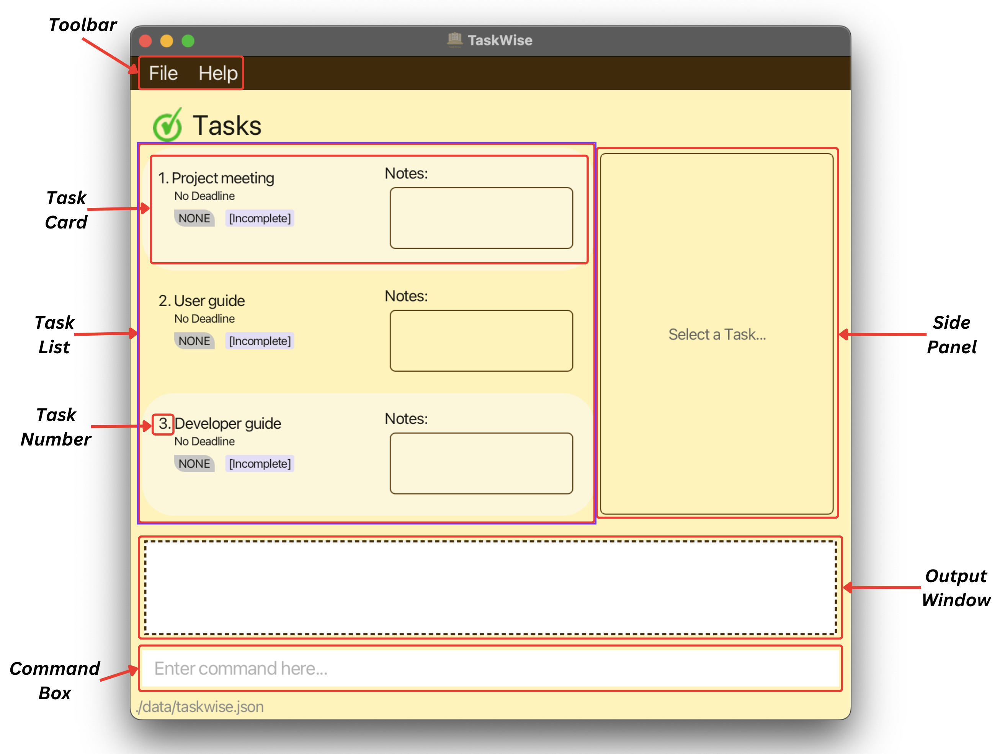
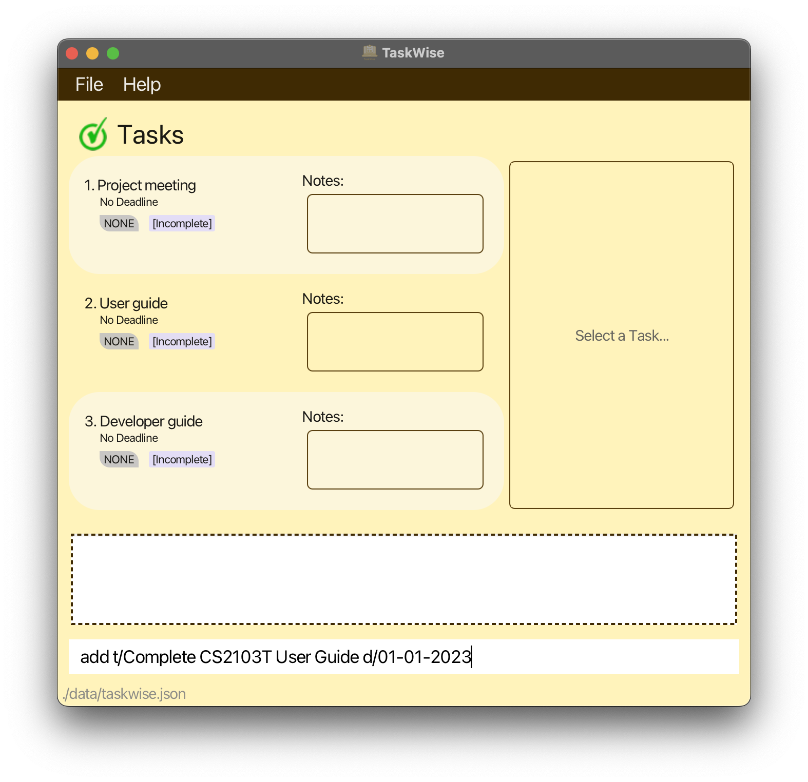
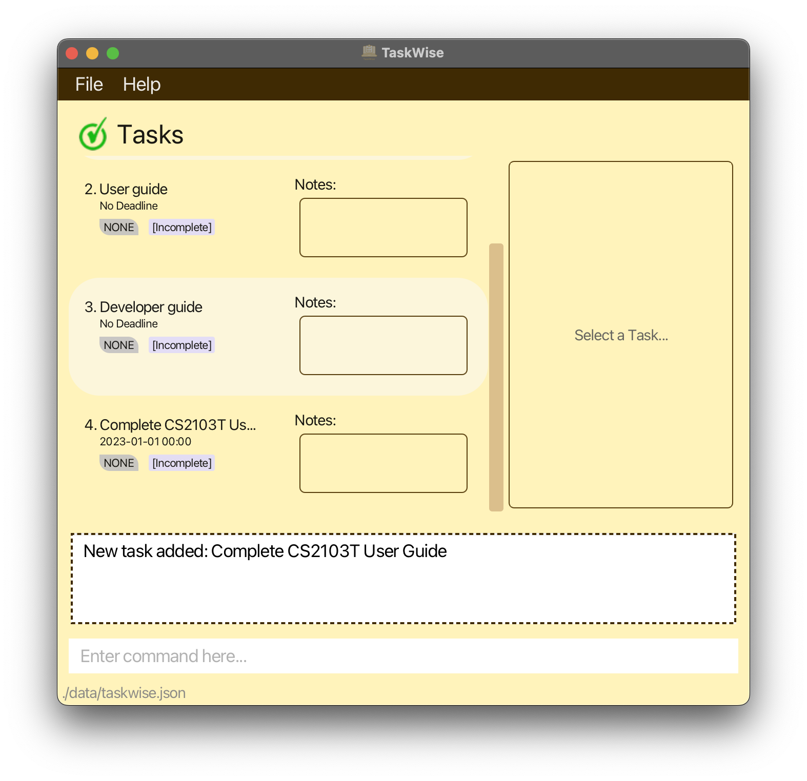
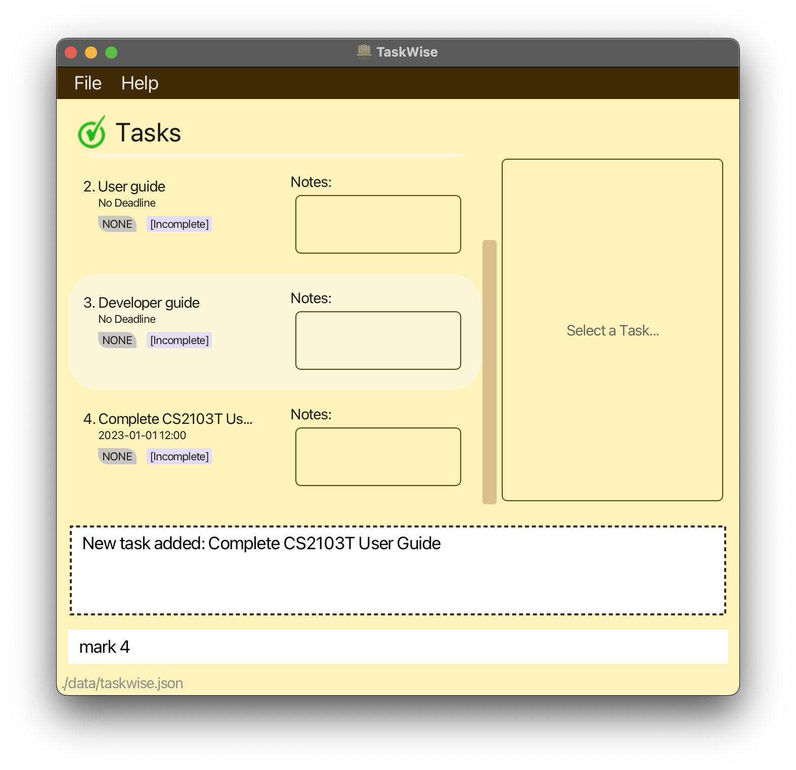
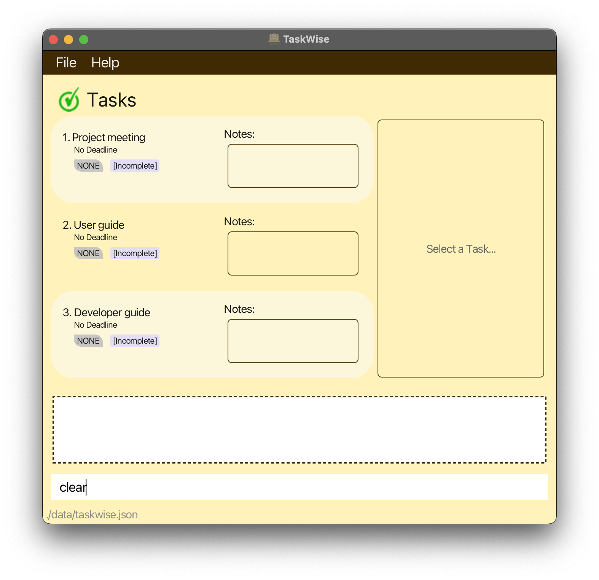
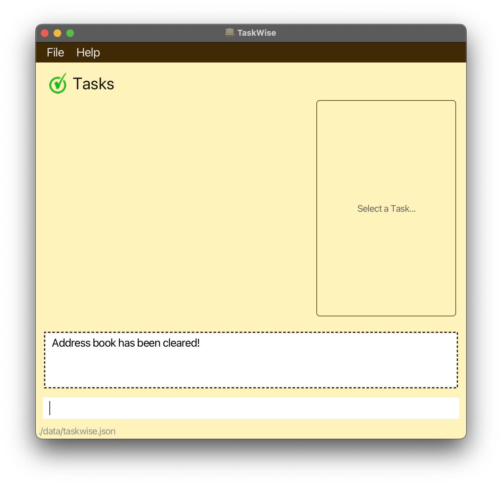
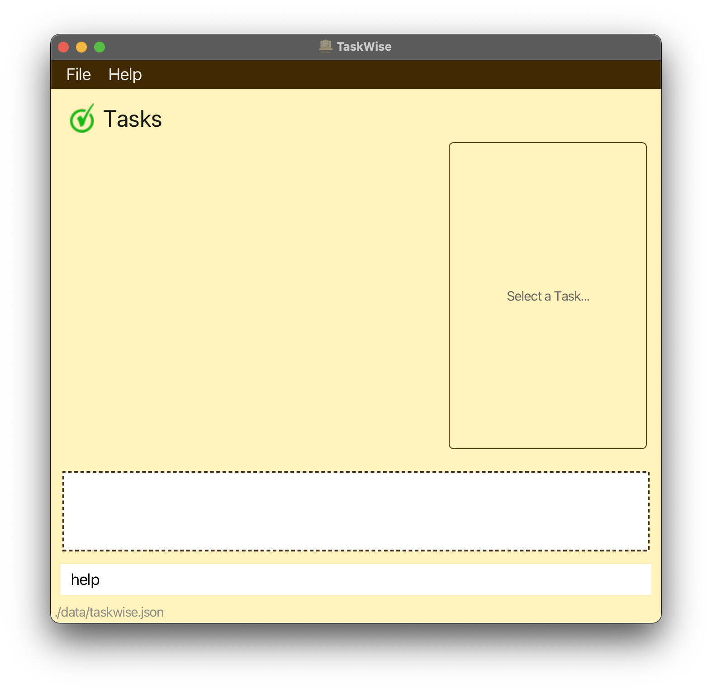
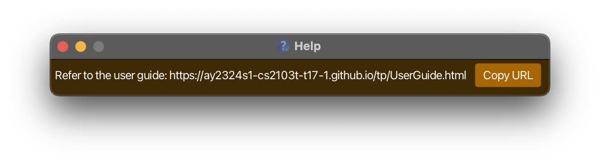
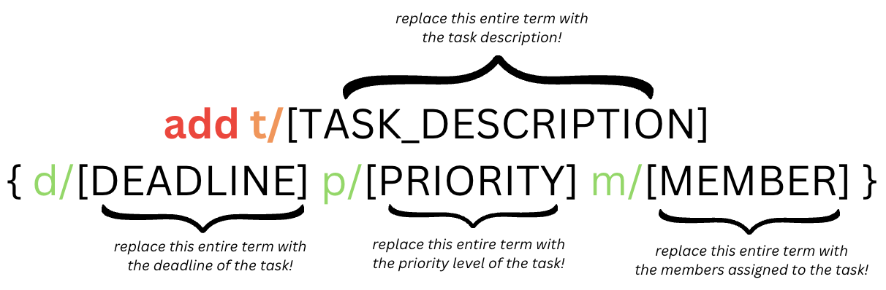
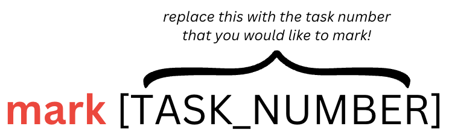

Welcome to the TaskWise User Guide!

TaskWise is a GUI/CLI program made for **CS2103T Project Managers** to help them keep track of and manage their project tasks.

Here's a quick summary of what TaskWise can do for you:

* All features are easily achieved using simple, typed commands!
* Reminders on how each command can be used!
* Add tasks into TaskWise and keep track of them!
* Add useful information like deadlines and priorities to each of your tasks!
* Reorder the tasks within the list at will to meet your needs!

## Table of Content

- [Introduction](#introduction)
  - [Usage of User Guide](#usage-of-user-guide)
- [Installation Guide](#installation-guide)
- [GUI Interface](#gui-interface)
- [Tutorial](#tutorial)
  - [Adding Your First Task](#adding-your-first-task)
  - [Marking Your First Task](#marking-your-first-task)
  - [Clearing Default Tasks](#clearing-default-tasks)
- [Features](#features)
  - [Prefixes](#prefixes)
  - [Getting Help](#getting-help)
  - [Add Tasks](#add-tasks)
  - [Mark Tasks as Complete](#mark-tasks-as-complete)
  - [Mark Tasks as Incomplete](#mark-tasks-as-incomplete)
  - [Add Notes to Tasks](#add-notes-to-tasks)
  - [Edit Tasks](#edit-tasks)
  - [View a Task](#view-a-task)
  - [Find a Task](#find-a-task)
  - [See All Tasks](#see-all-tasks)
  - [Sort Tasks](#sort-tasks)
  - [Delete Tasks](#delete-tasks)
  - [Clear All Tasks](#clear-all-tasks)
  - [Command Summary](#command-summary)
- [Planned Enhancements](#planned-enhancements)
  - [Ability To Add Tasks With The Same Description With Different Details](#ability-to-add-tasks-with-the-same-description-with-different-details)
  - [Inform User When Date Input Has Passed](#inform-user-when-date-input-has-passed)
  - [Edit Command - Different Modes](#edit-command---different-modes)
  - [Improve Find Command To Find By Priority, Deadline, Members and Notes](#improve-find-command-to-find-by-priority-deadline-members-and-notes)
  - [Case-insensitive Sort](#case-insensitive-sort)
  - [Case-insensitive Ordering of Members](#case---insensitive-ordering-of-members)
- [FAQ](#faq)
  - [General Questions](#general-questions)
  - [Task-Related Questions](#task-related-questions)

# Introduction

We've all been there. It's exam season, and all the project deadlines are coming! As your team's project manager, you will want to keep track of all the tasks that need to be done according to deadlines and priority levels.

TaskWise has a variety of features to help you do exactly just that! Download and install TaskWise today to start effortlessly managing your team's workload!

[[Jump to Table of Content]](#table-of-content)

## Usage of User Guide

This User Guide will guide you along in learning how to use TaskWise and what the different features of TaskWise are. If you are already an experienced user, click [here](#features) to jump straight to the summary of the different features of TaskWise and [here](#command-summary) to get to the summary of commands that you can enter into TaskWise.

Otherwise, just continue following the rest of the User Guide, from top to bottom, to fully learn and improve your project workflows with TaskWise!

One important thing before we jump into the guide, here are some things to note for you to understand the guide better. You might come across blocks of information that are coloured, and they are meant to highlight different kinds of information.

<div markdown="span" class="alert alert-info">
:information_source: The blue block highlights additional information that might be useful in clearing some confusion.
</div>

<div markdown="span" class="alert alert-warning">
:warning: The yellow block draws attention to crucial information that requires careful consideration to mitigate potential risks or challenges.
</div>

<div markdown="span" class="alert alert-danger">
:bangbang: The red block highlights information that requires immediate attention due to potential irreversible risks.
</div>

You would also come across various commands to interact with our app. These commands will be explicitly shown in the following format:

```
Text in this box is a command
```

The capitalised words that are encapsulated in `[SQUARE_BRACKETS]` are meant to be replaced with whatever is appropriate. You do not need to care about the appropriate values for now as they will be expounded later on, the only takeaway is that they are **NOT** meant to be copied word for word.

For example, for the following command,

```
add t/[TASK_DESCRIPTION]
```

you can replace `[TASK_DESCRIPTION]` with something else, such as:

```
add t/do OP2 slides
```

Note that the `[]` is not included as part of the command!

Lastly, words that are [blue](#blue) are hyperlinks that either lead to another site, or another section in this guide, which you can use to ease your navigation!

Now that we got the basics out of the way, let's jump right into the guide!

[[Jump to Introduction]](#introduction)

# Installation Guide

1. Ensure that you have Java 11 installed on your computer. Click [here](https://blog.hubspot.com/website/check-java-verison#:~:text=First%2C%20find%20and%20click%20on,get%20your%20current%20version%20details) to learn how to find out what Java version you have! If you do not have Java 11, you can download Java 11 by following the guide below:

- [Windows](https://docs.oracle.com/en/java/javase/11/install/installation-jdk-microsoft-windows-platforms.html#GUID-A7E27B90-A28D-4237-9383-A58B416071CA)
- [MacOS](https://docs.oracle.com/en/java/javase/11/install/installation-jdk-macos.html#GUID-2FE451B0-9572-4E38-A1A5-568B77B146DE)
- [Linux](https://docs.oracle.com/en/java/javase/11/install/installation-jdk-linux-platforms.html#GUID-737A84E4-2EFF-4D38-8E60-3E29D1B884B8)

2. You might also need to install JavaFX 11. You can find the installation guide [here](https://openjfx.io/openjfx-docs/#install-javafx).

<div markdown="span" class="alert alert-info">
:information_source: In this installation guide, you'll see the term "JDK" being used. Don't worry! JDK stands for "Java Development Kit", and you can treat it as the same as Java!
</div>

3. Download the latest `taskwise.jar` from [this page](https://github.com/AY2324S1-CS2103T-T17-1/tp/releases/tag/V1.3.1).
4. Drag and drop the file from your computer's downloads into any folder you want.
5. Open up the [terminal](https://support.apple.com/en-sg/guide/terminal/apd5265185d-f365-44cb-8b09-71a064a42125/mac) (Mac), [terminal emulator](https://www.redhat.com/sysadmin/linux-terminal-window) (Linux) or [command prompt](https://support.kaspersky.com/common/windows/14637#block0) (Windows).
6. Type `cd` followed by the directory path to the folder where you have downloaded TaskWise to navigate there and press `Enter`. For example, if you have downloaded TaskWise to your desktop, you can type the following command:

```
cd ~/Desktop
```

7. Use the command `java -jar taskwise.jar` to get the application running.

If you have done everything correctly, you should see the TaskWise application open up in a few seconds!


If you have reached this point in the User Guide, congratulations! You are now one step closer to being a proficient TaskWise wizard!

[[Jump to Table of Content]](#table-of-content)

# GUI Interface

It may seem daunting at first when you first launch TaskWise, but no worries, let us break down the different components of the GUI and CLI interface for you!



Here is a short description of what each component can do and how it is supposed to behave:

| Component Name | What It Does                                                                  | How It Behaves                                                                         |
|----------------|-------------------------------------------------------------------------------|----------------------------------------------------------------------------------------|
| Toolbar        | Provides a GUI shortcut for users to access file and help                     | Updates whenever you change task information                                           |
| Command Box    | Reads the user input and executes it                                          | Key in your commands here and simply press 'enter' or 'return' to run it!              |
| Task List      | Displays all the task cards                                                   | Provides an ordered snapshot of tasks in your task list                                |
| Task Card      | Displays the summarised details of the task                                   | Select it to view the task's full detail in the side panel                             |
| Output Window  | Displays the message from the system based on the execution of the user input | It will update with a message from TaskWise based on the execution of the user's input |
| Side Panel     | Displays the full details of the selected task                                | It will only show a task's details when you view a task                                |

Now that you have learnt the different components of the GUI/CLI interface which you will interact with TaskWise through, let us move on to a tutorial on how you can get up and running on TaskWise!

[[Jump to Table of Content]](#table-of-content)

# Tutorial

Picture this: it is the middle of the semester and your midterms are here! However, you realise that your CS2103T project deliverables are starting to pile up, and it is up to you as your group's Project Manager to distribute the work among your members and track these deliverables to ensure that the task is completed on time!

Feeling overwhelmed? Fret not, for TaskWise is here to the rescue!

We shall now take you through the process of how you can start your project management journey with TaskWise, by adding your first task to TaskWise!

[[Jump to Table of Content]](#Table-of-Content)


## Adding Your First Task

Tasks are completable objectives with or without deadlines. They form the basis for which you can begin your project management journey with TaskWise!

By adding tasks to TaskWise, you are able to keep track of all the tasks related to your project.

Within the window, left-click on the command box, and key in the command `add t/Complete CS2103T User Guide d/01-01-2023` into the text box, before pressing the "Enter" or "Return" key.

<div markdown="span" class="alert alert-warning">
:warning: Due to the current limitations of the features provided in TaskWise with regards to the capitalisation of Task Description, you are encouraged to be consistent with the capitalisation of your Task Descriptions of the Tasks that you create!
</div>



This adds a task with the title `Complete CS2103T User Guide` and the deadline is set to `01-01-2023`. Any task created by you is set as incomplete by default.

If successful, you should be able to see the following task entry in your window, after you scroll down the task list to view the last element added, as seen below!



Congratulations! You have just added your first task to track into TaskWise!

[[Jump to Tutorial]](#tutorial)

[[Jump to Add Task Feature]](#add-tasks)

## Marking Your First Task

After working tirelessly together with your teammates, you managed to complete your User Guide. Hooray! Time to check that item off your to-do list!

Hold on a moment! TaskWise can handle that for you! Simply type in the command `mark 4` into the text box, before pressing the "Enter" or "Return" key.



This marks the task you created in the previous step as completed.

If successful, you should be able to see the following on your window after you scroll to the end of the task list!


Nice job! You have just marked the first of many tasks in TaskWise!

[[Jump to Tutorial]](#tutorial)

[[Jump to Mark Task Feature]](#mark-tasks-as-complete)

## Clearing Default Tasks

Now that you have added and marked your first task, you should be more familiar with TaskWise's user interface! Do look through the steps again if you feel confused. Otherwise, you can start to use TaskWise to add your own tasks. You may wish to clear the default tasks that are in TaskWise when you first open them up.

Just type in the `clear` command into the text box, before pressing on the "Enter" or "Return" key. You can now use TaskWise as you wish, on a clean slate!

| Before                                                 | After                                                |
|--------------------------------------------------------|------------------------------------------------------|
|  |  |

<div markdown="span" class="alert alert-danger">
:bangbang: The `clear` action is irreversible and permanent! Exercise extreme caution when using this command!
</div>

Rejoice! You have completed the Tutorial on TaskWise.

You are now officially a TaskWise Wizard, ready to use TaskWise to enhance your workflows and manage your project tasks in CS2103T!

[[Jump to Tutorial]](#tutorial)

[[Jump to Clear Task Feature]](#clear-all-tasks)

# Features

Looking for a more detailed explanation of what commands TaskWise can understand? Click [here](#add-tasks) to jump straight to it!

Otherwise, read on to find out more about the features that TaskWise offers!

[[Jump to Table of Content]](#table-of-content)

## Prefixes

Now, before we start with the features proper, let's introduce an important concept in the usage of TaskWise: **Prefixes**!

Prefixes allow you to specify certain important values to TaskWise while you are entering any command into the command box.

Remember the command that was previously used in the tutorial?

```
add t/Complete CS2103T User Guide d/01-01-2023
```

The task created by this command contains information about the **task's description** and the **deadline** of the associated task.

This is denoted by the `t/` and `d/` prefixes respectively.

Now, with the power of prefixes, in the same command, you can add even more useful information using the same command!

One such prefix would be the `p/` command, allowing you to change the **priority level of the task** that is being created.

After all, you wouldn't want to miss the most important submission worth 50% of your grade because you didn't see it among the mountain of other tasks you have, right?

```
add t/Complete CS2103T User Guide d/01-01-2023 p/high
```

By adding the `p/` prefix into the same command, you can now create the task within TaskWise, with a priority level set to `high` instead of a priority level of `none`.

**Table of Prefixes**

Here is a table of all available prefixes you can use within TaskWise:

| Prefixes | Description                                                                |
|----------|----------------------------------------------------------------------------|
| `t/`     | The prefix used to indicate the description of the task.                   |
| `d/`     | The prefix used to indicate the deadline of the task.                      |
| `p/`     | The prefix used to indicate the priority of the task.                      |
| `m/`     | The prefix used to indicate the member you wish to assign to the task.     |
| `n/`     | The prefix used to indicate the note you wish to associate with the task.  |
| `o/`     | The prefix used to indicate the order you wish to sort the task list by.   |
| `ty/`    | The prefix used to indicate the type you wish to sort the task list by.    |

If these prefixes do not make sense to you at this moment, fret not! More information on the prefixes will be provided to you as you use them in the upcoming sections!

[[Jump to Features]](#features)

## Getting Help

If you ever feel overwhelmed by the number of commands TaskWise has, worry not! Whenever you need to refer back to this guide, simply type in the `help` command, and TaskWise will give you the necessary link to come back to this guide!

**Format**

Simply type in the following command:

|                         Help Command                          |
|:-------------------------------------------------------------:|
|  |
|                            `help`                             |

to view a **popup window** with a link to our user guide in it!

| Before                                       | After                                      |
|----------------------------------------------|--------------------------------------------|
|  |  |

### Parameter(s)

The `help` command does not require any parameters; simply type in the `help` command and get all your questions answered!

<div markdown="span" class="alert alert-info">
:information_source: If you accidentally, or intentionally, enter in any number of parameters with the `help` command, they will be ignored and the command will work as usual!
</div>

[[Jump to Features]](#features)

## Add Tasks

If you recall, you have already seen this feature in the tutorial! Fret not, you can always head over to [here](#adding-your-first-task) if you need a quick recap on adding tasks.

Now that you have learnt about adding tasks in TaskWise, let's take it to the next level! While adding tasks with a deadline into TaskWise may be useful to track tasks and their respective deadlines, TaskWise can help you keep track of so much more!

**Format**

Adding of tasks consists of 1 compulsory parameter (`TASK_DESCRIPTION`) and 3 optional parameters (`DEADLINE`, `PRIORITY`, `MEMBER`)!

|                            Add Command                            |
|:-----------------------------------------------------------------:|
|       |
| `add t/[TASK_DESCRIPTION] {d/[DEADLINE] p/[PRIORITY] m/[MEMBER]}` |

<div markdown="span" class="alert alert-info">
:information_source: The parameters in { curly braces } such as `d/[deadline]`, `p/[priority]` and `m/[member]` are OPTIONAL! They are not necessary for the task to be added, and can be arranged in ANY order.
<br/><br/>
You can always edit the default values of these optional parameters using the [****edit command****](#edit-tasks).
</div>

<div markdown="span" class="alert alert-info">
:information_source: You can add a maximum of 1 deadline and 1 priority but more than 1 member to a task!
</div>

### Parameter(s)

**TASK_DESCRIPTION**

This is all you really need to add a task! It is the description of your task that you want to keep track of, and it is compulsory for it to be filled out before your task successfully gets added to TaskWise.

ANY character is allowed, except for blanks and `/`.

<div markdown="span" class="alert alert-warning">
:warning: Due to the current limitations of the features provided in TaskWise with regards to the capitalisation of Task Description, you are encouraged to be consistent with the capitalisation of your Task Descriptions of the Tasks that you create!
<br/><br/>
Refer to [this](#case---insensitive-sort) section for more information on this issue! Rest assured that we are working hard to improve your user experience and we appreciate your patience on this issue while we work on an appropriate fix for this issue!
</div>

**DEADLINE**

This is optional to include when you add a task. However, if you would like to add the deadline of a task, ensure that they adhere to the following formats:

| Format             | Description                                                                          |
|--------------------|--------------------------------------------------------------------------------------|
| `dd-mm-yyyy`       | The date, month, and year of your deadline                                           |
| `dd-mm-yyyy HH:mm` | The date, month and year as well as the hour and minute in 24 hours of your deadline |

Do note that you are able to add deadlines for tasks that are before the present date in order to keep track of submissions even after their deadline has passed!

<div markdown="span" class="alert alert-info">
:information_source: You can use the `-` OR `/` between the date, month and year inputs.
You can use the `:` OR `-` OR nothing between the hour and minute of your time inputs. Lastly, your date, month, hour and minute must be 2 digits, while your year must be 4 digits long. 
</div>

**PRIORITY**

This is also an optional field! Your tasks will have a default priority of `None`, if you do not assign a priority. However, if you wish to assign a priority to a task, you can simply enter 1 of the 4 priority levels:

- `none`
- `low`
- `medium`
- `high`

each corresponding to the stated priority levels (e.g. `low` corresponds to `Low` priority)!

Priority is not case-sensitive!

**MEMBER**

This is the last optional field of the `add` command. You can assign 1 or more members to a task. ANY character is allowed, except for blanks and `/`.

<div markdown="span" class="alert alert-warning">
:warning: By default, the list of members added is also sorted using the same algorithm that is used to sort the tasks by Task Description! You are advised to be consistent in your use of capitalisation in the name of the members you add to your task!
<br/><br/>
Refer to [this](#case---insensitive-ordering-of-members) section for more information on this issue! Rest assured that we are working hard on fixing this issue to make your TaskWise experience a more enjoyable and productive one!
</div>

**Examples of correct usage**

* `add t/Fix User Interface`
* `add t/Developer Guide p/medium`
* `add t/OP2 Meeting d/01-01-2023 m/ALL p/high`
* `add t/User Guide d/04-11-2023 2100 m/may m/sean m/justin m/george m/seb p/high`

**Expected Output**

Click [here](#adding-your-first-task) to refer to the quick start guide for `add` command to see an example of the expected output!

**Common Mistakes**

When there is an error, the instruction with the proper use of the command will be given to you!

Head over to the [Task-Related Questions](#task-related-questions) section to find out more about what the common mistakes are!

### Limitations

Currently, TaskWise allows us to only add tasks that are of different names, whether or not parameters such as deadline, priority, status or member are different. We acknowledge that there may be some inconvenience faced and would love to help you workaround this limitation!

**Numbering**

If you have tasks that you wish to add with the same description `CS2103T Meeting`, consider numbering them. For example, `CS2103T Meeting 1`, `CS2103T Meeting 2`, `CS2103T Meeting 3` etc. With the numbering, the task descriptions will each be unique and you can have different deadlines, priority levels, status and members attributed to them!

**Deletion**

Another way you can tackle this problem is to [delete](#delete-tasks) a task that was already completed, instead of leaving it in TaskWise marked as `[Complete]`. That way, you can add the task of that same description, with perhaps a different deadline and `[Incomplete]` status.

There we go! With these workarounds, you can defy the limitations of TaskWise! Do refer to our [planned enhancements](#planned-enhancements) if you are interested to know more about how we plan to enhance this feature to allow for adding tasks of the same description with different parameters.

[[Jump to Features]](#features)

## Mark Tasks as Complete

If you need a quick recap on what you can do with the `mark` command, refer to [here](#marking-your-first-task).

**Format**

The `mark` command only consists of 1 parameter, the `TASK_NUMBER`, which is the number that you see associated with each task in the task list.

|                         Mark Command                          |
|:-------------------------------------------------------------:|
|  |
|                     `mark [TASK_NUMBER]`                      |

### Parameters

**TASK_NUMBER**

Acceptable values to use with the `mark` command will therefore be integers within a range from 1 to the total number of tasks you currently have in TaskWise!

**Examples of correct usage**

- `mark 1`
