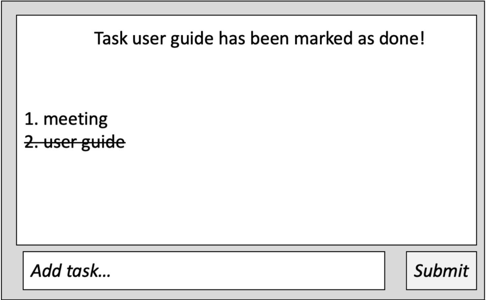
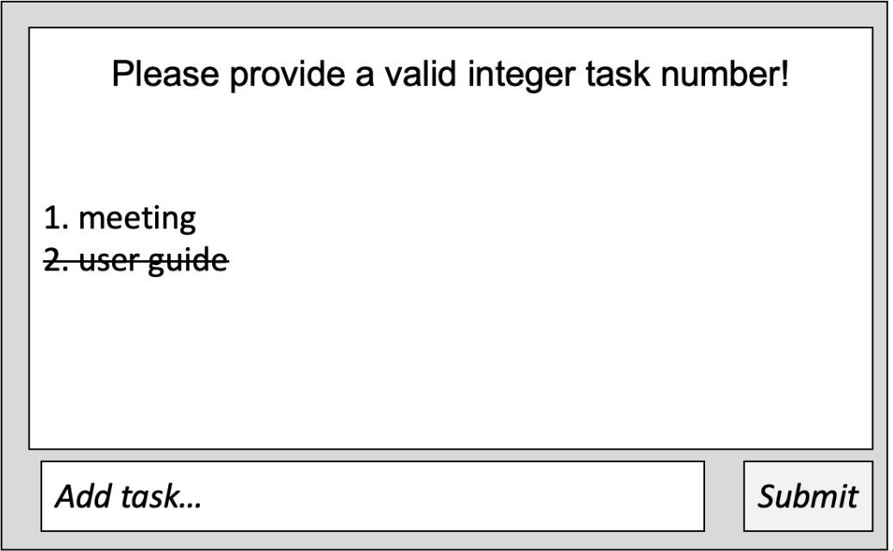

AddressBook Level 3 (AB3) is a **desktop app for managing contacts, optimized for use via a Command Line Interface** (CLI) while still having the benefits of a Graphical User Interface (GUI). If you can type fast, AB3 can get your contact management tasks done faster than traditional GUI apps.

* Table of Contents
{:toc}

--------------------------------------------------------------------------------------------------------------------

## Quick start

1. Ensure you have Java `11` or above installed in your Computer.

1. Download the latest `addressbook.jar` from [here](https://github.com/se-edu/addressbook-level3/releases).

1. Copy the file to the folder you want to use as the _home folder_ for your AddressBook.

1. Open a command terminal, `cd` into the folder you put the jar file in, and use the `java -jar addressbook.jar` command to run the application. 
   A GUI similar to the below should appear in a few seconds. Note how the app contains some sample data. 
   

1. Type the command in the command box and press Enter to execute it. e.g. typing **`help`** and pressing Enter will open the help window. 
   Some example commands you can try:

   * `list` : Lists all contacts.

   * `add n/John Doe p/98765432 e/johnd@example.com a/John street, block 123, #01-01` : Adds a contact named `John Doe` to the Address Book.

   * `delete 3` : Deletes the 3rd contact shown in the current list.

   * `clear` : Deletes all contacts.

   * `exit` : Exits the app.

1. Refer to the [Features](#features) below for details of each command.

--------------------------------------------------------------------------------------------------------------------

## Features

### Feature #5: Unmark tasks as done in TaskWise

**User Story:** As a clumsy project manager, I want to be able to unmark tasks that were marked in case I accidentally marked them so that I can undo my mistake

**Feature Description**

**What it does**
* Unmark tasks as undone

**Command**
* `unmark [task index]`

**Example**

* `unmark 1`

**Acceptable values for each parameter**

* Any integer that is between 0 to (total number of tasks - 1) inclusive

**Expected output**

* Popup window displaying string: "Task [Task name] has been marked as undone!"
* GUI strikethrough removed

**Expected output (fail)**

Cause: Wrong Number - Out of Bounds

| Explanation | Description |
|---|---|
| Example | `unmark 3` (when there are only 2 tasks) |
| Expected Outputs | Popup window displaying text: “Please provide a valid integer task number” |

Cause: No Index Provided

| Explanation | Description |
|---|---|
| Example | `unmark` (no task number provided) |
| Expected Outputs | Popup window displaying text: “Please provide a valid integer task number” |

Cause: Non-Integer Input for List Index

| Explanation | Description |
|---|---|
| Example | `unmark this` (no task number provided) |
| Expected Outputs | Popup window displaying text: “Please provide a valid integer task number” |

## UI

### Adding a task: `add`

Adds a task to the task list

Format: `add [task name]`

Examples:
* `add` meeting
* `add` user guide

#### Acceptable values for each parameter
* Any valid Strings

#### Expected output

* Popup window with text: “[task status][task name] has been added successfully!”
* The task entry will be displayed on the main GUI screen

#### Expected output (fail)

#### Cause: Missing Description

| Explanation | Description |
|---|---|
| Cause | Missing Description |
| Example | `add` |
| Expected Outputs | Popup window displaying text: “Please enter a  valid task in this format “add {task name}”! |
### Mark a task as done : `mark`

Marks a task as done.

Format: `mark INDEX`

* Marks a task at a specified index as being done.

Examples:

* `mark 1`

Output with valid input:

Acceptable values for each parameter:

* Any integer that is between 0 to (total number of tasks - 1) inclusive

Expected output:

* Popup window displaying string: "Task [Task name] has been marked as done!"
* GUI strikethrough removed

**Expected output (fail)**:

Cause: Wrong Number - Out of Bounds

| Explanation | Description |
|---|---|
| Example | `mark 3` (when there are only 2 tasks) |
| Expected Outputs | Popup window displaying text: “Please provide a valid integer task number” |

Cause: No Index Provided

| Explanation | Description |
|---|---|
| Example | `mark` (no task number provided) |
| Expected Outputs | Popup window displaying text: “Please provide a valid integer task number” |

Cause: Non-Integer Input for List Index

| Explanation | Description |
|---|---|
| Example | `mark this` (no task number provided) |
| Expected Outputs | Popup window displaying text: “Please provide a valid integer task number” |

Output with invalid input:

### Saving the data

AddressBook data are saved in the hard disk automatically after any command that changes the data. There is no need to save manually.

### Editing the data file

AddressBook data are saved automatically as a JSON file `[JAR file location]/data/addressbook.json`. Advanced users are welcome to update data directly by editing that data file.

:exclamation: **Caution:**
If your changes to the data file makes its format invalid, AddressBook will discard all data and start with an empty data file at the next run. Hence, it is recommended to take a backup of the file before editing it.

### Archiving data files `[coming in v2.0]`

_Details coming soon ..._
--------------------------------------------------------------------------------------------------------------------

## FAQ

**Q**: How do I transfer my data to another Computer? 
**A**: Install the app in the other computer and overwrite the empty data file it creates with the file that contains the data of your previous AddressBook home folder.

--------------------------------------------------------------------------------------------------------------------

## Known issues

1. **When using multiple screens**, if you move the application to a secondary screen, and later switch to using only the primary screen, the GUI will open off-screen. The remedy is to delete the `preferences.json` file created by the application before running the application again.

--------------------------------------------------------------------------------------------------------------------

## Command summary

Action | Format, Examples
--------|------------------
**Add** | `add n/NAME p/PHONE_NUMBER e/EMAIL a/ADDRESS [t/TAG]…​`   e.g., `add n/James Ho p/22224444 e/jamesho@example.com a/123, Clementi Rd, 1234665 t/friend t/colleague`
**Clear** | `clear`
**Delete** | `delete INDEX`  e.g., `delete 3`
**Edit** | `edit INDEX [n/NAME] [p/PHONE_NUMBER] [e/EMAIL] [a/ADDRESS] [t/TAG]…​`  e.g.,`edit 2 n/James Lee e/jameslee@example.com`
**Find** | `find KEYWORD [MORE_KEYWORDS]`  e.g., `find James Jake`
**List** | `list`
**Help** | `help`
